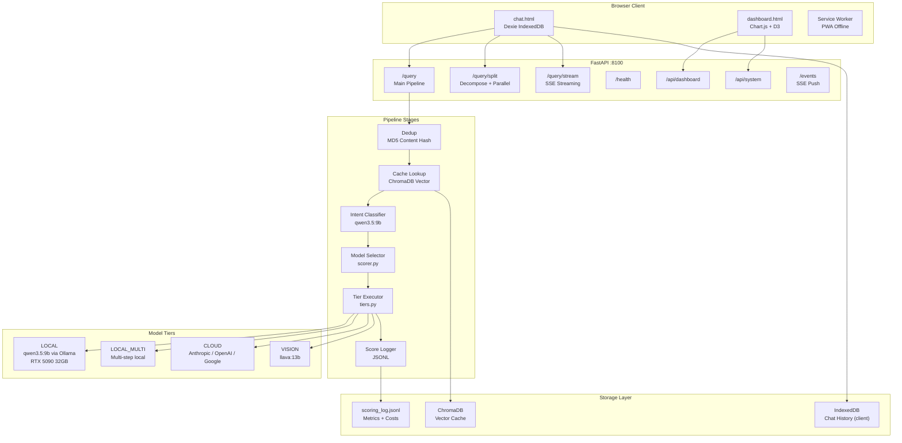
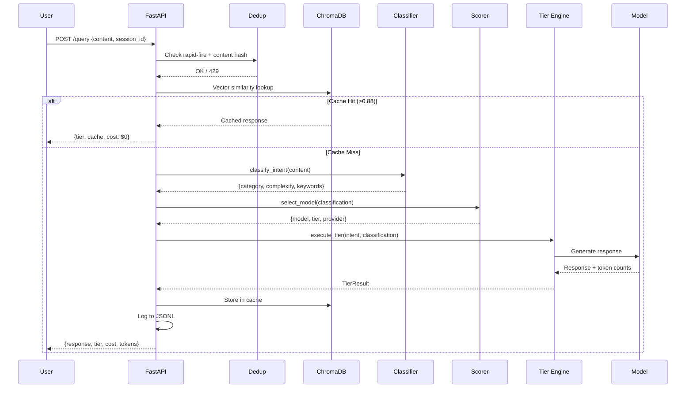
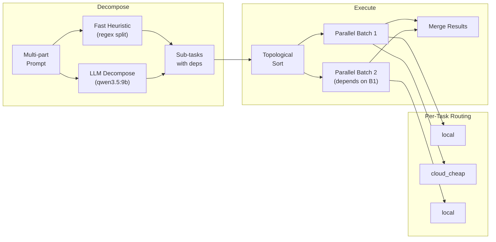

# muLLM Architecture

## System Overview

muLLM is a local-first LLM router that classifies user intent, routes to the cheapest capable model, and caches results. Local models handle simple tasks free; cloud APIs (Anthropic, OpenAI, Google) only for genuinely complex work.



## Request Flow (Single Query)



## Split Routing (Multi-Task Decomposition)



## Cost Tiers

| Tier | Models | Cost Range | Use Case |
|------|--------|-----------|----------|
| `cache` | ChromaDB vector match | $0.00 | Repeat/similar queries |
| `local` | qwen3.5:9b (Ollama) | $0.00 | Simple tasks, lookups, notes |
| `local_multi` | qwen3.5:9b multi-step | $0.00 | Multi-step local reasoning |
| `cloud_cheap` | Haiku, GPT-4o-mini, Flash | $0.001-0.01 | Medium complexity |
| `cloud_full` | Opus, GPT-4o, Pro | $0.01-0.50 | Complex analysis, large code |

## Safety & Guards

- **Rapid-fire detection**: 20 req/min per session -> 429
- **Content dedup**: MD5 hash, 2s window
- **Hard timeout**: 10 min absolute max per request
- **Budget caps**: Auto-approve ceiling, ask-approval ceiling (configurable)
- **Session cost tracking**: Cumulative per-session spend visible in UI

## File Map

```
mullm/
  router/
    main.py          # FastAPI app, endpoints, pipeline orchestration
    intent.py         # Intent classifier (local LLM)
    tiers.py          # Tier execution engine (local, cloud, vision)
    cloud.py          # Cloud API clients (Anthropic, OpenAI, Google)
    scorer.py         # Model selection, cost logging, session tracking
    decomposer.py     # Split routing decomposer
    models.py         # Pydantic models (IntentObject, PipelineResult, etc.)
    chat.html         # Single-file chat UI (HTML + JS + CSS)
    dashboard.html    # Dashboard UI (Chart.js, D3, isometric views)
    manifest.json     # PWA manifest
    sw.js             # Service worker
  config/
    settings.py       # All configuration, model pricing, thresholds
  cache/
    vector.py         # ChromaDB vector cache wrapper
    data/             # ChromaDB storage + scoring_log.jsonl
  tests/
    test_router.py    # Pipeline integration tests
    test_classifier.py # Classifier accuracy tests
  *.spec.js           # Playwright E2E tests (59 tests)
```
