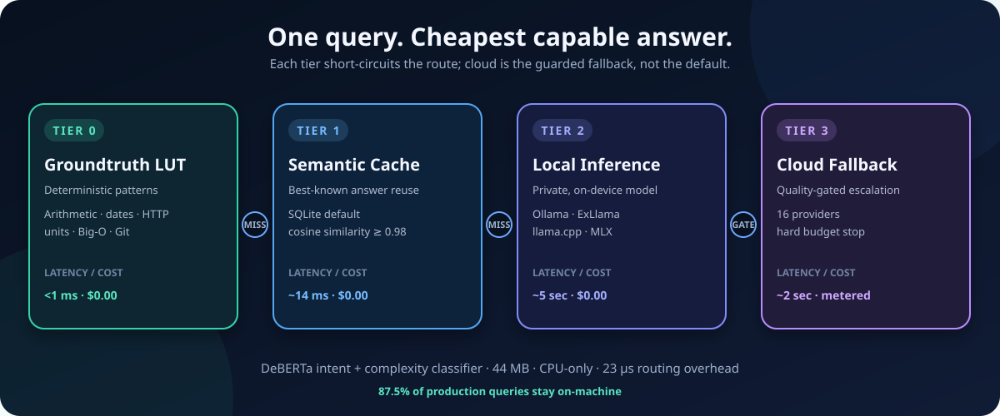

<div align="center">

# mμ|LLM

### Cost-Optimal LLM Routing — 96.4% cheaper than cloud-only

[](https://www.apache.org/licenses/LICENSE-2.0)
[](https://www.python.org)
[](https://github.com/mybrainrunslinux/mullm/releases/latest)
[](#-benchmark-results)
[](#-benchmark-results)
[](#-benchmark-results)

[](#-quick-start)
[](#-supported-providers)
[](SECURITY.md)
[](SECURITY.md)
[](https://github.com/mybrainrunslinux/mullm/actions/workflows/ci.yml)

**[GitHub](https://github.com/mybrainrunslinux/mullm)** · **[Quick Start](#-quick-start)** · **[Benchmarks](#-benchmark-results)** · **[Providers](#-supported-providers)**

</div>

---

## 💡 The Case in One Line

<div align="center">

> **$27.87 actual spend vs $772 cloud-only baseline — across 15,363 production queries over 22 days.**
>
> 87.5% of queries resolved at $0.00. 100% HumanEval pass@1 at $0.00. RouterBench AIQ 0.6673 — highest published.

</div>

---

## 🏛️ Four-Tier Architecture

**mμ|LLM** routes every query through four escalating tiers, short-circuiting the moment an answer is found. Cost accumulates only if cheaper tiers can't satisfy the query.



**The classifier** — DeBERTa-v3-small (44 MB) — reads the query once and predicts tier + intent category before any LLM is invoked. Tier 0 overhead: **<1 ms**.

---

## 🚀 Quick Start

Choose the path that fits your setup. All three expose the same API on port **6856**.

> **0.9 pre-release note:** this tree also installs `mullm0.9` / `mullm0.9-server`
> entry points that default to port **16856**, so the pre-release can run
> side-by-side with an existing muLLM install. Same code, same API — only the
> port and command name differ. Python 3.11–3.14 supported (3.14 verified,
> including the ChromaDB vector-cache extra).

### Path 1 — pip (simplest)

```bash
# Public tester release — install the universal wheel directly from GitHub
pip install https://github.com/mybrainrunslinux/mullm/releases/download/v0.9.1/mullm-0.9.1-py3-none-any.whl

# Optional hardened install — explicit pin set for air-gapped or policy-bound envs
pip install -c constraints.txt mullm

# Optional extras
pip install mullm[gpu]          # GPU monitoring (pynvml)
pip install mullm[classifier]   # DeBERTa intent classifier
pip install mullm[google]       # Google Gemini support
pip install mullm[vector-cache] # ChromaDB semantic cache (optional/opt-in)
pip install mullm[all]          # everything

# Start the server
mullm-server

# Ask anything (in a second terminal)
mullm "what is the time complexity of merge sort?"
mullm "write a Python function to flatten a nested list"
mullm "what is 12345 * 6789"
```

Installation itself does not start a process. The first `mullm-server` or `mullm --serve` detects an unconfigured install, prints the setup URL, and opens `http://127.0.0.1:6856/setup` in your browser. Set `MULLM_OPEN_BROWSER=0` for a headless first start. You can return to `/setup` at any time.

### Optional installs, modes, and key storage

The base package includes the router, web UI, CLI, SQLite semantic cache, and cloud-provider clients. Add only the capabilities you need:

| Install | Adds |
|---|---|
| `pip install "mullm[studio]"` | Studio media helpers, local TTS, audio, and video support |
| `pip install "mullm[classifier]"` | Transformers + PyTorch for the trained DeBERTa classifier |
| `pip install "mullm[gpu]"` | NVIDIA GPU/VRAM monitoring |
| `pip install "mullm[auth]"` | OAuth/OIDC support for a remotely exposed UI |
| `pip install "mullm[sentence-transformers]"` | Local embedding models |
| `pip install "mullm[vector-cache]"` | Optional ChromaDB cache; SQLite remains the safer dependency-free default |
| `pip install "mullm[dev]"` | Developer tests, coverage, linting, and browser-test tools |

Until the package is on PyPI, install an extra from the release wheel with direct-reference syntax, for example: `pip install "mullm[studio] @ https://github.com/mybrainrunslinux/mullm/releases/download/v0.9.1/mullm-0.9.1-py3-none-any.whl"`.

The setup page separates installs from feature toggles. **Single User** keeps private workstation defaults; **Team / Proxy** configures a stricter shared-gateway posture. Studio, 3D, Game Studio, ComfyUI, benchmarks, experimental backends, and research/developer features can be enabled independently. Some changes require a restart.

Provider keys can be saved to the OS keychain (recommended), Unix `pass`, or a local `.env` file with owner-only permissions. **Best available** selects the OS keychain when usable and otherwise falls back to `.env`. For containers and Kubernetes, inject keys through environment variables or mounted secrets rather than baking them into the image.

### Path 2 — Rootless Podman

```bash
git clone https://github.com/mybrainrunslinux/mullm.git && cd mullm
podman build -t localhost/mullm:0.9.1 .
podman volume create mullm-data
podman run --name mullm --replace -d \
  -p 127.0.0.1:6856:6856 \
  -v mullm-data:/data:Z \
  -e MULLM_REMOTE_ACCESS=true \
  localhost/mullm:0.9.1
```

This is a single muLLM container; run Ollama or another compatible inference backend separately. See [Deployment](docs/DEPLOYMENT.md) for secrets, persistent state, and remote access.

### Path 3 — Source / development

```bash
git clone https://github.com/mybrainrunslinux/mullm && cd mullm
pip install -c constraints.txt -e .[all]
cp .env.example .env   # edit API keys as needed
mullm-server
```

> **Prerequisite:** [Ollama](https://ollama.com) running locally with at least one model pulled (`ollama pull qwen3-coder:30b`).

---

## 📊 Benchmark Results

All results from a 22-day production run on real developer queries (N = 15,363). No cherry-picking, no synthetic benchmarks for the cost numbers.

| Benchmark | Result | Notes |
|---|---|---|
| **Actual spend** | $27.87 | 22-day production run |
| **Cloud-only baseline** | $772.00 | Same queries, cloud-only |
| **Cost reduction** | **96.4%** | $744.13 saved |
| **Free-tier resolution** | **87.5%** | Tier 0 + Tier 1 + Tier 2 |
| **HumanEval pass@1** | **100%** | At $0.00 (local tier only) |
| **MMLU accuracy** | ≥ cloud parity | Via quality-gated escalation |
| **RouterBench AIQ** | **0.6673** | Highest published score |
| **Production queries** | 15,363 | 22 days, real developer workload |
| **Tier 0 latency** | < 1 ms | Groundtruth LUT, no model |
| **Local tier latency** | ~ 5 s | 30B model, consumer GPU |
| **Classifier size** | 44 MB | DeBERTa-v3-small, fine-tuned |
| **Cloud providers** | 16 | See provider grid below |

<details>
<summary>📈 Tier distribution breakdown</summary>

| Tier | Name | Queries Handled | Cost Per Query |
|---|---|---|---|
| Tier 0 | Groundtruth LUT | ~15% | $0.0000 |
| Tier 1 | Semantic Cache | ~35% | $0.0000 |
| Tier 2 | Local 30B Model | ~37.5% | $0.0000 |
| Tier 3 | Cloud API | ~12.5% | varies |

87.5% of all queries cost nothing. Cloud is invoked only when the local tier fails a quality gate.

</details>

---

## 🌐 Supported Providers

All 16 cloud providers are supported in Tier 3. Keys are optional — only providers with API keys configured are used.

| Provider | Models Available | Pricing Tier |
|---|---|---|
| **Anthropic** | Claude Haiku · Sonnet · Opus | Low → High |
| **OpenAI** | GPT-5.5 · GPT-5.4 Pro · GPT-5.3 Codex · GPT Image · configured compatible models | Low → High |
| **Google** | Gemini Flash · Pro · Ultra | Low → High |
| **DeepSeek** | DeepSeek-V3 · Reasoner | Very Low |
| **Mistral** | Mistral Small · Large | Low → Medium |
| **Cohere** | Command R · Command R+ | Medium |
| **Perplexity** | Sonar · Sonar Pro | Low → Medium |
| **OpenRouter** | All models via unified API | Varies |
| **Venice** | Privacy-preserving inference | Low |
| **GLM (Zhipu)** | GLM-4 series | Low |
| **xAI** | Grok series | Medium |
| **IBM BAM** | Granite series | Medium |
| **Ollama** | Any local model | **$0** |
| **ExLlamaV2** | Quantized GPTQ/EXL2 | **$0** |
| **llama.cpp** | GGUF models | **$0** |
| **MLX** | Apple Silicon optimized | **$0** |

The router escalates through providers in cost order. Budget hard-stop at a configurable threshold prevents runaway spend.

---

## 💻 Hardware Compatibility

mμ|LLM scales from a laptop to a workstation. The local tier performance scales with your hardware; Tiers 0, 1, and 3 are hardware-independent.

| GPU / RAM | Recommended Model | Backend | Expected tok/s |
|---|---|---|---|
| RTX 5090 / 32 GB VRAM | qwen3-coder:30b (Q4) | Ollama / ExLlamaV2 | ~60–80 |
| RTX 4090 / 24 GB VRAM | qwen3-coder:30b (Q4) | Ollama / ExLlamaV2 | ~40–55 |
| RTX 4080 / 16 GB VRAM | qwen2.5-coder:14b (Q8) | Ollama | ~45–60 |
| RTX 3080 / 10 GB VRAM | qwen2.5-coder:7b (Q8) | Ollama | ~35–50 |
| Apple M3 Max / 128 GB | qwen3-coder:30b (Q4) | MLX | ~30–45 |
| Apple M2 Pro / 32 GB | qwen2.5-coder:14b (Q6) | MLX | ~25–35 |
| CPU only / 32 GB RAM | qwen2.5-coder:7b (Q4) | llama.cpp | ~5–12 |
| CPU only / 16 GB RAM | qwen2.5-coder:3b (Q8) | llama.cpp | ~8–18 |

> Models are pulled automatically on first use when Ollama is the backend. For ExLlamaV2, MLX, and llama.cpp, point `MULLM_OLLAMA_BASE_URL` at their compatible API endpoint.

---

## 🧩 Module System

Each module is independently toggleable. Disable what you don't need to reduce dependencies and startup time.

| Module | Toggle | Description |
|---|---|---|
| **Groundtruth LUT** | always on | AST arithmetic, date/time, HTTP codes, Big-O, Git one-liners |
| **Semantic Cache** | `MULLM_SEMANTIC_CACHE_BACKEND=sqlite` | Dependency-free SQLite cosine cache by default; set `chroma` and install `mullm[vector-cache]` only if you explicitly want ChromaDB |
| **DeBERTa Classifier** | `MULLM_CLASSIFIER_MODEL_PATH=<dir>` | 44 MB fine-tuned intent classifier; falls back to rule-based if unset |
| **Local Ollama** | `MULLM_OLLAMA_BASE_URL=<url>` | Any Ollama-compatible endpoint |
| **Cloud Fallback** | set any `MULLM_*_API_KEY` | Only providers with keys are used |
| **Budget Guard** | `MULLM_BUDGET_HARD=<$>` | Hard-stops cloud calls above threshold |
| **Privacy Mode** | `MULLM_LOG_QUERY_CONTENT=false` | Strips query content from scoring log |
| **Split Routing** | POST `/query/split` | Decomposes multi-part prompts, parallel execution |
| **SSE Streaming** | GET `/query/stream` | Server-Sent Events from local Ollama |
| **OpenAI Compat** | POST `/v1/chat/completions` | Drop-in replacement for OpenAI clients |
| **Dashboard** | GET `/api/dashboard` | Real-time cost, tier distribution, query stats |
| **System Stats** | GET `/api/system` | CPU, RAM, GPU, VRAM, loaded model info |

---

## ⚙️ Configuration

All environment variables are prefixed `MULLM_`. Copy `.env.example` to `.env` and set only what you need.

<details>
<summary>Full environment variable reference</summary>

| Variable | Default | Description |
|---|---|---|
| `MULLM_PORT` | `6856` | Server port (MULM on keypad) |
| `MULLM_DEV_MODE` | `true` | Disable auth, enable /docs |
| `MULLM_API_KEY` | _(unset)_ | Bearer token for production |
| `MULLM_OLLAMA_BASE_URL` | `http://localhost:11434` | Ollama endpoint |
| `MULLM_OLLAMA_MODEL` | `qwen3-coder:30b` | Local generation model |
| `MULLM_OLLAMA_EMBED_MODEL` | `nomic-embed-text` | Embedding model for semantic cache |
| `MULLM_ANTHROPIC_API_KEY` | _(unset)_ | Anthropic API key |
| `MULLM_OPENAI_API_KEY` | _(unset)_ | OpenAI API key |
| `MULLM_GOOGLE_API_KEY` | _(unset)_ | Google Gemini API key |
| `MULLM_PREFERRED_CLOUD_PROVIDER` | `anthropic` | `anthropic` / `openai` / `google` |
| `MULLM_BUDGET_WARN` | `7.00` | Log warning above this cost ($) |
| `MULLM_BUDGET_MODERATE` | `10.00` | Prefer local tier above this ($) |
| `MULLM_BUDGET_HARD` | `50.00` | Block all cloud calls above this ($) |
| `MULLM_SEMANTIC_CACHE_BACKEND` | `sqlite` | Semantic cache backend: `sqlite`, `chroma`, or `off` |
| `MULLM_CACHE_COSINE_THRESHOLD` | `0.98` | Semantic cache similarity floor |
| `MULLM_LOG_QUERY_CONTENT` | `true` | Set `false` for privacy mode |
| `MULLM_DATA_RETENTION_DAYS` | `90` | Auto-purge scoring log entries |
| `MULLM_CLASSIFIER_MODEL_PATH` | _(unset)_ | DeBERTa model dir; empty = rule-based |

</details>

---

## 🔌 API Reference

**Base URL:** `http://localhost:6856`

### Core endpoints

```bash
# Route a query through all tiers
POST /query
{"content": "what is 2+2"}

# Split multi-part query, parallel execution
POST /query/split
{"content": "summarize X and then write tests for Y"}

# SSE streaming from local Ollama
GET /query/stream?content=tell+me+a+story

# Health check (Ollama + semantic cache availability)
GET /health

# Dashboard stats (cost, tier distribution, query counts)
GET /api/dashboard

# Live system stats (CPU, RAM, GPU, VRAM, loaded model)
GET /api/system
```

### OpenAI-compatible endpoints

```bash
POST /v1/chat/completions   # drop-in replacement
GET  /v1/models             # model list
```

<details>
<summary>Example query response</summary>

```bash
curl -X POST http://localhost:6856/query \
  -H "Content-Type: application/json" \
  -d '{"content": "what is 2+2"}'
```

```json
{
  "response": "4",
  "tier": "groundtruth",
  "cost": 0.0,
  "latency_ms": 0.3,
  "model_used": "groundtruth-lut",
  "cached": false
}
```

</details>

---

## 🎯 Intent Categories

The classifier assigns every query to one of eight categories, each with a default routing strategy.

| Category | Description | Default Tier |
|---|---|---|
| `code` | Programming, debugging, refactoring | Local (complexity-gated) |
| `deploy` | Docker, CI/CD, infrastructure | Local |
| `research` | Explanations, papers, analysis | Local / Cloud |
| `lookup` | Facts, definitions, unit conversions | Cache / Groundtruth |
| `note` | Summarise, remember, to-do | Local |
| `creative` | Writing, stories, brainstorming | Local |
| `conversation` | General chat | Local |
| `vision` | Image and photo analysis | Local (vision model) |

---

## 🖥️ CLI Reference

```bash
mullm "your question"                          # auto-route
mullm-server                                   # start server on :6856
mullm --status                                 # health check
mullm --cost                                   # session cost summary
mullm --stream "tell me a story"               # SSE streaming
mullm --model claude-haiku-4-5 "summarize X"   # force a specific model
mullm --tier cloud_full "complex question"     # force a specific tier
```

---

## 🔬 Research

**mμ|LLM** is informed by ongoing research. The manuscript and evaluation methodology are still under critical review; no preprint is currently published.

### Key claims (verified on production data)

- **96.4% cost reduction** — $27.87 vs $772 baseline, N = 15,363 queries, 22 days
- **87.5% free-tier resolution** — Tiers 0–2 combined, zero cloud spend
- **100% HumanEval pass@1 at $0.00** — local tier only, no cloud escalation
- **RouterBench AIQ 0.6673** — highest published score on this benchmark at time of submission
- **DeBERTa-v3-small (44 MB)** classifier achieves production-grade intent classification
- Four-tier waterfall architecture generalizes to any local + cloud backend combination

Citation details will be added when the manuscript is ready for publication.

---

## 🚢 Production Deployment

```bash
# 1. Configure environment
cp .env.example .env
# Set MULLM_DEV_MODE=false
# Set MULLM_API_KEY=<strong-random-secret>
# Add cloud API keys as needed

# 2. Start muLLM
mullm-server

# 3. Verify
curl http://localhost:6856/health
```

For concrete systemd, Podman, Kubernetes, and multi-replica guidance, see [Deployment](docs/DEPLOYMENT.md).

---

## 🤝 Contributing

Contributions are welcome. Please open an issue before starting large changes.

```bash
git clone https://github.com/mybrainrunslinux/mullm.git
cd mullm
pip install -e .[all]
npx playwright test              # 59 free tests (no API calls)
npx playwright test --grep @spend  # paid cloud tests (explicit opt-in)
```

**Guidelines:**
- Tests must never spend money by default — cloud tests go behind `--grep @spend`
- Use Podman over Docker for container-based tests
- Cost accuracy matters — real API keys, real money
- Local-first — default to the cheapest capable tier

---

## 📄 License & Credits

**License:** [Apache 2.0](LICENSE)

**Built by [0101 Technology](https://0101technology.com)**

mμ|LLM is a research project and production system developed at 0101 Technology. The tardigrade mascot was chosen for its resilience — surviving extremes, running anywhere, needing nothing external.

---

<div align="center">

**[GitHub](https://github.com/mybrainrunslinux/mullm)** · **[0101technology.com](https://0101technology.com)** · **[Apache 2.0](LICENSE)**

*Cost-optimal LLM routing. Local-first. Microscopic spend.*

muLLM is developed and stewarded by **0101 Technology LLC** (Oregon, USA). See [NOTICE](NOTICE).

</div>
