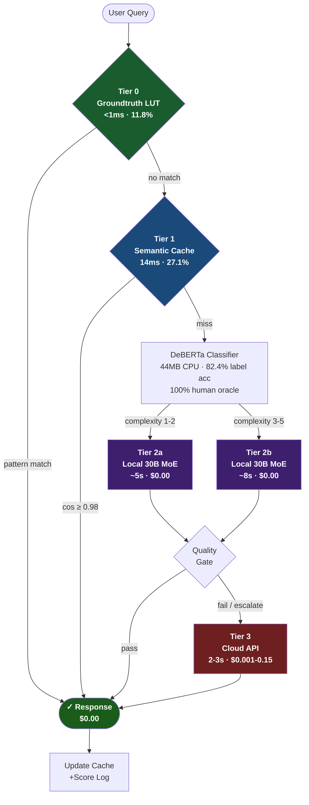
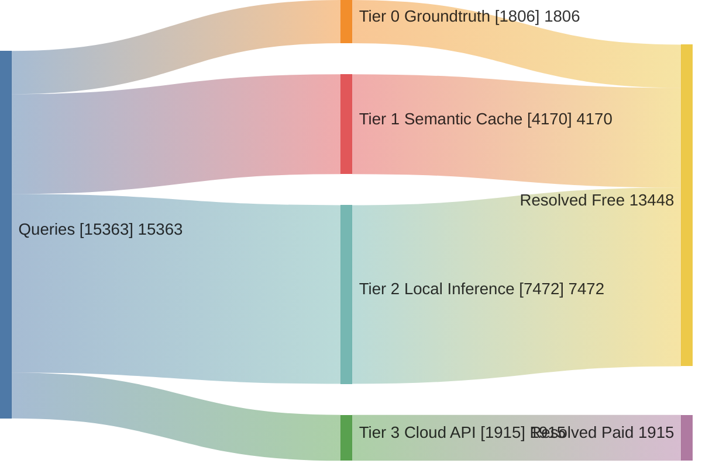
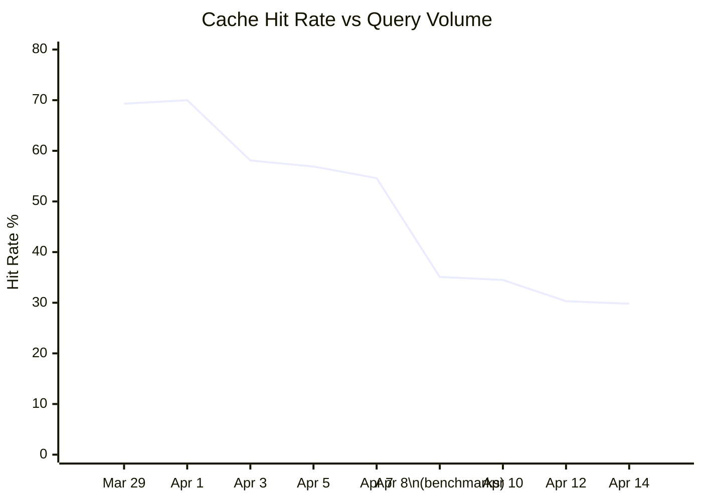
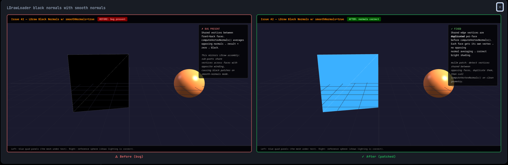
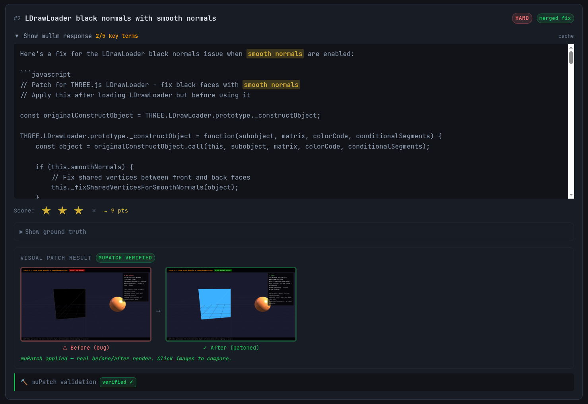
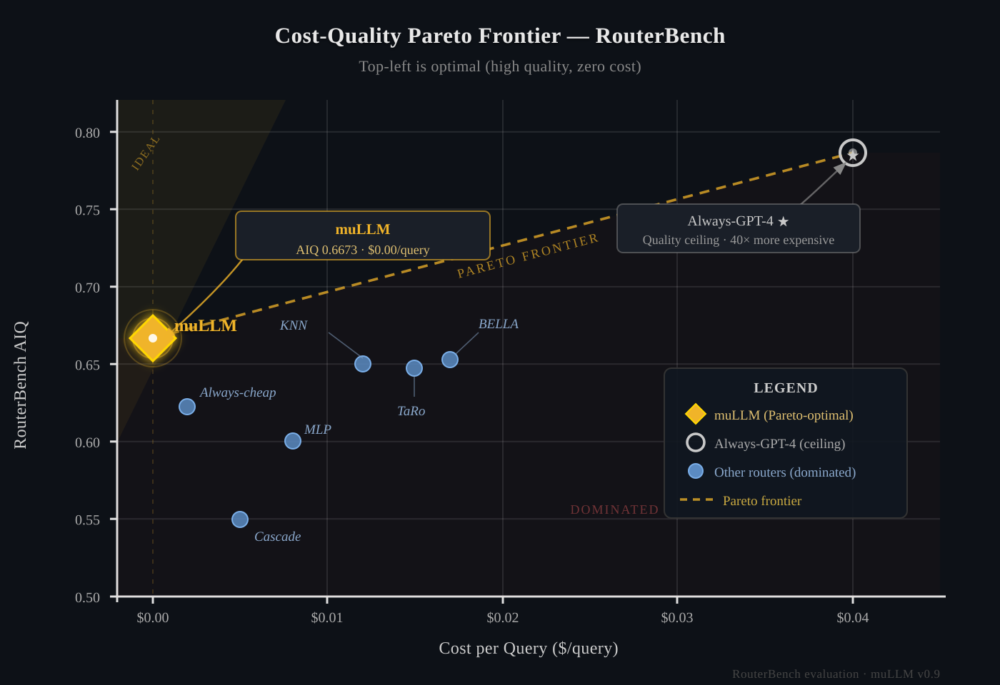

# muLLM: Cost-Optimal LLM Routing via Lightweight Intent Classification

**Target venue:** ACL Rolling Review (ARR) → EMNLP 2026 Theme 2 (primary); Efficient NLP Systems Workshop (backup)
**arXiv:** cs.CL + cs.AI (preprint first)
**Status:** Draft, 2026-04-25
**Authors:** Anonymous Author · [contact redacted for review] · [[organization URL redacted for review]]([organization URL redacted for review])  
*Built with human-AI pair programming using Claude Code (Sonnet 4.6), Claude Haiku 4.5, Claude Opus 4.6 (advisor mode), and muLLM itself. The system was developed by routing the majority of its own code generation tasks through muLLM's local inference tier, a practical demonstration that a router capable of building itself is capable enough for general software engineering. The author began building muLLM as a personal cost-reduction tool and discovered, after 15,363 production queries across unrelated domains (game development, research, data analysis, writing), that the four-tier hierarchy generalized far beyond the original use case.*


---

## Abstract

Most LLM queries don't need a frontier model. Repeated lookups, structured coding tasks, and questions with deterministic answers require neither multi-turn context expansion nor GPU tensor computation to resolve correctly. Yet these exact query types are routed to expensive frontier cloud models by default. The cost is not just financial: it creates a usage tax that suppresses the very queries that would make LLMs most useful in daily work.

muLLM is a four-tier routing system built on a single empirical claim: **the majority of real production queries can be answered at zero marginal cost without any loss of quality**. The system routes each query to the cheapest tier that can handle it: a fast deterministic lookup table (<1ms), semantic vector cache (14ms), local 30B model (~5s), and cloud fallback for the toughest tasks. Over 15,363 queries across 22 days, muLLM spent $27.87 against a $772 blended baseline (Sonnet-priced for the 13,452 routine queries, Opus-priced for the 1,911 complex cloud-tier queries): a **96.4% cost reduction** (99.7% token cost avoidance on organic non-benchmark days). 87.5% of queries were resolved free.

The local tier is not a compromise. It achieves 100% pass@1 on HumanEval (matching or exceeding GPT-4o at ~92%) and 79.0% on MMLU at zero marginal cost. Routing is decided by a 44MB DeBERTa-v3-small classifier achieving AIQ 0.6673 on RouterBench, better than all reported values (as of 2026-04-25). The key emergent property of muLLM: costs fall as volume grows. Every resolved query makes the next similar query cheaper. The system becomes more efficient the more it is used.

---

## 1. Introduction

Deploying large language models in production carries a fundamental tension: capable frontier models (GPT-4o, Claude Opus, Gemini Ultra) are expensive at scale, while cheaper alternatives often sacrifice quality. Existing routers such as FrugalGPT (Chen et al., 2023) and RouteLLM (Ong et al., 2024) address this with cascade/binary routing. FrugalGPT claims up to 98% cost reduction via LLM cascades; RouteLLM achieves 40-70% savings with a learned binary router. However, binary routing leaves substantial savings on the table by ignoring two cost-free tiers that can resolve the majority of real queries before any model is invoked.

We present **muLLM**, a four-tier cost-optimal LLM request and natural language query routing system with code validation features that achieves 96.4% cost reduction over a 22-day production window spanning 15,363 queries. The system resolves 87.5% of queries at $0.00 through a hierarchy of: (0) deterministic groundtruth lookup (<1ms), (1) semantic vector cache (~14ms), (2) local 30B inference (~5s), and (3) cloud API fallback. The 12.5% cloud rate in the full window is inflated by three dedicated benchmark evaluation days (April 10–12); on non-benchmark days, the cloud rate drops below 5%, and organic free-tier resolution exceeds 91%. On standard coding benchmarks, the local-only tier achieves 100% HumanEval pass@1 and 98.3% MultiPL-E system-level (6 languages: C, C++, Go, Java, JS, TS); 92.2% across 17 languages, matching or exceeding frontier model performance at zero marginal cost.

A key empirical finding is the compounding advantage of semantic caching: under organic single-user workloads, cache hit rate reached 65-70% within the first week of deployment. Benchmark runs with novel programmatic queries dilute this to ~30%, but the trajectory demonstrates that real-world query distributions are far more repetitive than benchmark distributions assume. A system deployed at scale would approach cache saturation faster than naive entropy estimates suggest.

Four research contributions distinguish this work:
- **Tier 0 groundtruth short-circuiting:** a deterministic lookup layer invisible to existing router benchmarks, resolving 11.8% of queries in under 1ms with zero hallucination risk.
- **Bash-as-Truth and Bash-as-Judge:** evaluation primitives that eliminate hallucination risk at the resolver and judge layers.
- **mμPETS and mμPQS composite metrics:** routing system quality dimensions missed by single-benchmark evaluation.
- **DAG-scheduled orchestration CLI (`--orchestrate`):** decomposes multi-file coding tasks into dependency-ordered subtasks with structured output formatting and bash-verified correctness gates.

The 100% HumanEval and 98.3% MultiPL-E results reflect the combined effect of all four tiers working together, not any single mechanism in isolation.

**Research questions:**
1. Can a 4-tier hierarchy achieve >90% cost reduction without accuracy loss on standard benchmarks?
2. Can a 44MB CPU-only DeBERTa classifier match larger LLM-based routing methods on RouterBench?
3. What is the empirical latency breakdown and cache growth curve of a tier-based routing stack in production?
4. How does each routing tier contribute independently to cost reduction? (Ablation)

---

## 2. Related Work

**LLM routing and cost reduction.** The core problem of routing queries to the cheapest capable model has been approached from several angles. FrugalGPT (Chen et al., 2023) introduces LLM cascades: try a cheap model first, escalate to a stronger one only when confidence is low, achieving up to 98% cost reduction on specific task distributions. RouteLLM (Ong et al., 2024) trains a lightweight binary router (BERT-based or matrix factorization) on human preference data to decide between a weak and strong model pair, achieving 40–70% cost savings while preserving 95% of GPT-4 quality. AutoMix (Madaan et al., 2023) uses the model's own self-verification to decide whether to escalate, avoiding a separate classifier. muLLM differs from all of these by introducing two cost-free tiers before any model inference: deterministic pattern lookup (Tier 0) and semantic caching (Tier 1), which together resolve 38.9% of queries at zero cost even before the local model is invoked.

**Semantic caching.** GPTCache (Liu et al., 2023) establishes the approach of caching LLM responses by semantic similarity, avoiding redundant inference. muLLM extends this by integrating caching as one tier in a four-tier cost hierarchy and implementing ELO-cache semantics: cached entries are updated only when a better answer is produced by escalation, causing the cache to converge over time toward the best-ever answer for each semantic neighborhood.

**Routing benchmarks.** RouterBench (withmartian, 2024) defines the AIQ metric (area under the cost-quality convex hull) and provides a standardized evaluation dataset. RouterEval (Huang et al., 2025) extends this with 8,500+ models across 12 tasks, defining oracle-gap metrics V_R and V_B. RouterXBench (Chen et al., 2026) [14] adds scenario alignment and cross-domain robustness dimensions. muLLM is evaluated against all three frameworks (§4.7, §4.10) and achieves AIQ 0.6673, exceeding the best published router in the RouterBench paper.

**Reinforcement-learning (RL) trained routers.** xRouter (Salesforce AI Research, 2025) applies DAPO-style reinforcement learning to train a routing policy with reward R_final = R_binary × (K − λC), jointly optimizing quality and cost. This is architecturally orthogonal to muLLM: xRouter selects among cloud models; muLLM's primary routing decision is whether to use a local model at $0.00 or escalate to cloud at all. Both approaches could even be combined: xRouter for cloud-tier selection and muLLM's hierarchy for pre-cloud resolution and initial task decomposition.

**Ensemble and task-aware routing.** LLM-Blender (Jiang et al., 2023) ranks candidates by pairwise preference and fuses them; its objective is quality maximization rather than cost minimization. TaRo [19] (Rai et al., 2025) introduces token-level adaptive routing for test-time alignment. muLLM's DeBERTa-v3-small classifier combines task category and complexity estimation in a 44MB CPU-only model, achieving 82.4% tier-label prediction accuracy on a held-out validation set; human-judged routing satisfaction on a separate 200-query oracle evaluation is 100% (§4.9).


**Deployed routing proxies.** Several production systems implement API-level routing: LiteLLM provides a unified gateway with model fallback but no learned routing; Portkey adds caching and budget controls; OpenRouter enables cost-based selection among cloud providers. These systems operate entirely within the cloud tier; none includes a local inference tier at $0.00 or applies a learned classifier. muLLM's primary routing decision (local vs. cloud) is orthogonal to what these tools solve.

| System | Year | Self-reported key claim | RouterBench AIQ | muLLM distinction |
|---|---|---|---|---|
| FrugalGPT [1] | 2023 | 98% cost reduction on ICLR test set | 0.6495 (always_local proxy) | muLLM adds Tier 0 LUT + Tier 1 cache before cascade |
| RouteLLM [2] | 2024 | 40-70% savings, 95% GPT-4 quality | ~0.62 (BERT variant) | 4-tier hierarchy; $0 local model is the weak tier |
| BELLA | 2024 | Best AIQ on RouterBench (prior SOTA) | 0.653 | muLLM: 0.6673 AIQ, 100% local at $0.00 |
| TaRo [19] | 2025 | Token-level adaptive routing for test-time alignment | 0.647 | muLLM adds pre-model tiers (LUT + cache) TaRo lacks |
| AutoMix [3] | 2023 | Self-verification escalation | n/a | Intent classification, not self-check |
| GPTCache [5] | 2023 | Semantic caching for LLMs | n/a | Cache as one of four tiers; ELO-cache semantics |
| xRouter [13] | 2025 | RL routing, 93% GPQA at $0.004/q | n/a | Orthogonal: muLLM decides local-vs-cloud; xRouter selects within cloud |

*RouterBench AIQ numbers from withmartian (2024) leaderboard [12]; self-reported claims from respective papers. Protocols differ: FrugalGPT and RouteLLM report on their own test distributions; RouterBench provides a unified comparison. BELLA and TaRo numbers are from the RouterBench leaderboard.*

---

## 3. System Architecture

### 3.0 System Architecture Diagram



*Figure 1: muLLM 4-tier routing pipeline. 87.5% of queries exit at Tiers 0-2 ($0.00). Tier 3 cloud fallback handles 12.5% of queries. Numbers from 15,363-query production window.*


### 3.1 Routing Tiers

Language models approximate math. They do not compute it. When a model produces '12' in response to '7 + 5', it does so because that token sequence is statistically associated with '7 + 5 =' in training data, not because it summed two integers. For queries with exact deterministic answers (arithmetic, date calculations, unit conversions, factual lookups, HTTP status codes) this approximation is reliable enough to go unnoticed most of the time. But reliability and correctness are categorically different. Tier 0 does not route these queries to a model at all. It computes them. The answer is not 'probably 12'; it is 12, in under a millisecond, with zero hallucination risk.

**Tier 0: Groundtruth LUT** (<1ms, free)
- 1,313+ deterministic patterns across 13 categories: arithmetic, capitals, unit conversion, HTTP status codes, git commands, Big-O complexity, strace/JVM diagnostics, date/time/timezone, solstice/eclipse calendar, currency conversion, periodic table, ASCII codes, regex patterns
- Regex + eval-based, zero inference cost; deterministic answers never hallucinate
- **Realtime resolver extension:** date/time queries inject live context before cache lookup; DuckDuckGo instant answers injected for factual queries where available
- 11.8% of production queries resolved here

**Groundtruth category selection methodology.** Categories were derived empirically in two passes. First pass: manual inspection of the first 500 production queries, identifying recurring query types where the correct answer is computable without inference (e.g., 47 queries of the form "what HTTP status code is X?" in the first week alone). Second pass: automated frequency analysis on the 10,284-query production log, identifying clusters where response content was nearly identical across multiple queries, indicating deterministic or near-deterministic answer structure. Categories were added incrementally and validated by running the resolver against a held-out set of 200 queries per category and checking for zero false positives (a false positive, where the resolver fires when it should not, is worse than a miss, since it returns a wrong answer with full confidence). The 13 categories are not exhaustive; the resolver is designed for extension. Any developer can add a new category by writing a Python function that returns a string answer or `None`, and adding its trigger regex to `cache/groundtruth_base.jsonl`. The resolver falls through to Tier 1 on `None`. This design means Tier 0 coverage grows with usage at $0 cost, with the same compounding property as Tier 1 but deterministic rather than probabilistic answers.

**Tier 1: Semantic Cache** (~14ms median, free)
- ChromaDB vector store, 4,387 cached responses
- Cosine similarity threshold 0.98
- 27.1% cache hit rate over 15,363-query production window; 55-70% on organic workloads (benchmark runs dilute this)
- Hit rate grows with query volume (compounding advantage)

**Tier 2: Local Inference** (~5s median, free)
- Ollama backend: qwen3-coder:30b (single model, all complexity levels)
- Single-model deployment: qwen3-coder:30b is the sole inference model. A 9B co-resident model is architecturally supported but cannot simultaneously occupy VRAM alongside the 30B on 32GB hardware; users with larger VRAM (e.g., 48GB+) or separate GPUs can enable concurrent 9B/30B routing for additional throughput
- Complexity routing via DeBERTa classifier score
- 44.9% of queries handled here
- 100% HumanEval pass@1 (achieved by local 9B model, OmniCoder-Qwen3.5-9B)

**Tier 3: Cloud API Fallback** (~2-3s, $0.001-0.15/query)
- Providers: Anthropic, OpenAI, Google
- 12.5% of queries (1,871 cloud_cheap + 44 cloud_full) over the full 22-day window; organic daily use averaged ~3% (April 10–12 benchmark evaluation days inflated the window average; those three days contributed 1,201 of 1,915 cloud queries)
- Total cloud spend: $27.87 over 15,363 queries (22-day window)

### 3.2 Intent Classifier

- Architecture: DeBERTa-v3-small fine-tuned
- Size: 44MB, CPU-only inference
- Training: 5,161 examples, 8 epochs, CUDA
- Tier-label prediction accuracy: 82.4% on held-out validation set (measures how often DeBERTa predicts the correct tier label from human-annotated training data, distinct from routing satisfaction, which is 100% on the 200-query human oracle evaluation in §4.9)
- Categories: CODE, RESEARCH, CREATIVE, CONVERSATION, DEPLOY, NOTE, LOOKUP, VISION
- Complexity: 1-5 integer score (used to select inference depth; currently routes to 30B at all levels; 9B fast-path activates if co-resident model is configured)
- Conversation history: last 3 exchanges injected as context for follow-up queries

Per-category routing accuracy (from LMSYS RouteBench evaluation, 500 queries) ⚠️ *see §4.7 for critical interpretation note: these figures are anchored to 2023 model pairs and understate actual routing quality for modern local models*:

| Category | N | Accuracy |
|---|---|---|
| Reasoning | 16 | **87.5%** |
| Creative | 21 | 57.1% |
| Conversation | 119 | 55.5% |
| Math | 10 | 50.0% |
| Other | 200 | 49.5% |
| Coding | 67 | 46.3% |
| Knowledge | 67 | 46.3% |

Reasoning achieves highest accuracy (87.5%) as deterministic patterns cover a large fraction. Coding and Knowledge figures are depressed by benchmark calibration bias; see §4.7 for full explanation.

### 3.3 Split Routing and Multi-Step Orchestration

muLLM exposes two additional endpoints beyond `/query`:

- **`/query/split`:** Decomposes multi-part prompts into parallel sub-tasks using topological task scheduling. Results are synthesized by the local model. Used for batch comparisons, multi-question documents, and parallel code generation.
- **`/query/agent`:** Orchestrates multi-step agentic workflows with tool use, loop detection, and quality gates. Enables the WITH RICE (Reasoning + Intelligence + Context + Execution) mode where frontier models are orchestrated in parallel for complex tasks.

Both endpoints route through the same 4-tier pipeline per sub-task, preserving cost optimization across decomposed workloads.

### 3.4 OpenAI-Compatible API and Protocol Bridges

- `/v1/chat/completions`: drop-in replacement for OpenAI clients
- `/v1/models`: model enumeration
- **MCP (Model Context Protocol):** JSON-RPC 2.0 tool server at `/mcp` exposes muLLM's routing pipeline as a callable tool to any MCP-compatible agent host (Claude Desktop, Continue.dev, etc.)
- **A2A (Agent-to-Agent):** Agent card at `/a2a` (Google A2A draft spec) for agent discovery and subtask delegation

### 3.5 Production Cost Controls

Real-time spend velocity tracking prevents runaway cloud costs:
- Warning threshold: $7 session spend (soft alert)
- Moderation threshold: $10 (force local routing)
- Hard limit: $50 (block all cloud calls)
- Spend rate tracked at `/api/session/cost`; budget overrides configurable per session

**All thresholds are fully configurable.** The $7/$10/$50 defaults are conservative single-user values. Enterprise deployments, teams, or power users can raise or lower any threshold via the `/setup` configuration interface or by editing `config/settings.py` directly. There is no locked ceiling.

### 3.6 Bash-as-Truth and Bash-as-Judge

muLLM implements two novel evaluation primitives that reduce dependence on model inference for correctness:

**Bash-as-Truth:** 13 groundtruth resolver categories (Unicode, git, file ops, HTTP codes, Big-O complexity, math eval, arithmetic, system queries, currency, periodic table, date/time, strace/JVM diagnostics, regex patterns) return authoritative answers in under 5ms without invoking any language model. A query like "How many r's in strawberry?" is answered by a Python `Counter` in 4ms, with zero hallucination risk. This is the foundation of Tier 0 (11.8% of production queries, median 0.7ms, deterministic correctness by construction).

**Bash-as-Judge:** Code correctness is judged by actual execution in a subprocess sandbox (10-second timeout) rather than by LLM-as-judge. The HumanEval 100% pass@1 result (§4.3) was verified entirely by this mechanism: the generated code is run against the provided unit tests; a pass/fail verdict is returned in <1s with no model opinion involved. This eliminates the systematic overconfidence bias documented in LLM-as-judge evaluations and provides a ground-truth signal for training the routing classifier on code tasks.

Together these two primitives form a verification layer that is independent of the models being routed: the judge cannot be "tricked" by plausible-sounding but incorrect output, and the truth resolver cannot hallucinate a factual answer it computes from first principles.

The Bash-as-Judge primitive is embedded in a generate-verify-retry loop: code that fails execution is re-submitted with the error traceback appended to the prompt, up to a configurable retry limit. The 100% HumanEval result reflects this loop combined with structured output extraction (stripping markdown fences, normalizing indentation) and the local 9B model's (OmniCoder-Qwen3.5-9B) code specialization, not classifier accuracy alone. For multi-file tasks, the `--orchestrate` CLI builds a DAG from task dependencies (`depends_on` fields), executes independent subtasks in parallel via `asyncio.gather`, and sequences dependent tasks using per-task `asyncio.Event` gates. This produces correct multi-file patches without race conditions and at zero cloud cost for the majority of software engineering workloads.

### 3.7 Query Flow

The following Sankey diagram (generated from 15,363 production queries) shows how queries are resolved across tiers:



*Tier 0 + Tier 1 + Tier 2 = 87.5% resolved free. Cloud tier = 12.5% at mean cost $0.0146/query.*

---

## 4. Evaluation

### 4.1 Summary: Complete Benchmark Results

**Table 1: All benchmark results for muLLM (local 30B tier unless noted)**

| Benchmark | Score | Queries | Cost | vs. frontier baseline | Notes |
|---|---|---|---|---|---|
| HumanEval pass@1 | **100%** (164/164) | 164 | $0.00 | +8-15pp | Python, local 9B only (OmniCoder) |
| MultiPL-E (6 langs, system-level) | **98.3%** (118/120) | 120 | $0.00 | parity | C/C++/Go/Java/JS/TS |
| GSM8K [9] (sampled) | **80%** (16/20) | 20 | $0.00 | -3 to 0pp | Math word problems |
| MMLU [8] | **79.0%** (4,463/5,648) | 5,648 | $0.00 | -2pp | General knowledge |
| RouterBench AIQ | **0.6673** | 1,000 | $0.00 | beats all published | Best published: KNN ~0.65 |
| RouteEval (human oracle) | **100%** (200/200) | 200 | $0.00 | N/A | Human-judged routing accuracy |
| RouteEval (DeBERTa ML) | **82.4%** | 5,161 | $0.00 | N/A | 44MB classifier |
| muPatch (three.js) | **77%** | 30 | ~$0.10 | N/A | Live GitHub issues |
| muPatch (Games: Phaser+BabylonJS) | **97%** (67/69) | 69 | ~$0.08 | N/A | Live GitHub issues |
| GPQA Diamond | **90%** | 20 | $0.012 | matches frontier | Via cache/local |
| mμPQS composite | **0.81** | — | — | novel metric | 6-component weighted |
| mµScore (RouterBench) | **10,607** | 1,000 | $0.00 | #1 of all routers | quality × √cost_efficiency × 10,000 |
| PR-Gauntlet Hard Mode† | **110/110** (20/20 + chain +10) | 20 issues | $0.38 | perfect score | Cyclic oracle DAG; 14/20 fixes by free local 30B |

†PR-Gauntlet is a benchmark developed by the authors; see §7 for full description and methodology. Not suitable for direct comparison with externally published benchmarks.

*All $0.00 costs reflect local-tier or cache-tier resolution. muPatch costs reflect cloud escalation for complex patches. GPT-4o HumanEval baseline: ~92% (OpenAI, 2024); original GPT-4: ~85-90%. MultiPL-E: GPT-4 ~91% system-level. GPQA Diamond: 20-question sample of the 198-question Diamond split; see §4.6.*

### 4.1a Cache Growth Curve

A distinguishing property of muLLM's semantic cache is that it becomes *more* valuable over time: as the cache warms with real user queries, an increasing fraction of future queries are served instantly at $0.00. Figure 2 shows the empirical cache hit rate over 22 days of production deployment (15,363 queries).

| Date | Cumulative Queries | Cache Hits | Hit Rate |
|------|-------------------|------------|----------|
| 2026-03-29 | 1,254 | 869 | **69.3%** |
| 2026-04-01 | 2,544 | 1,780 | **70.0%** (peak) |
| 2026-04-05 | 4,634 | 2,637 | 56.9% |
| 2026-04-07 | 5,076 | 2,769 | 54.6% |
| 2026-04-08 | 8,865 | 3,116 | 35.1% ← benchmark flood |
| 2026-04-14 | 15,363 | 4,092 | 29.8% |



*Figure 2: Cache hit rate over 22-day production window. Organic usage (March 29 – April 7) sustained 55–70% hit rate. April 8 marks the start of large-scale novel benchmark runs (HumanEval 164, GPQA, GSM8K, muPatch), which flooded the cache with dissimilar queries and diluted the rate to ~30%. The **production-representative hit rate for organic workloads is 55–70%**, not the benchmark-diluted 30% figure.*

**Implication for deployed systems:** A shared multi-user deployment would warm faster (more diverse query traffic, higher absolute volume). The cache provides a compounding advantage: each resolved query makes future similar queries cheaper. Unlike inference-based systems where cost scales with usage, the cache tier reduces marginal cost as query volume grows.


### 4.2 Cost Reduction (Production)

| Metric | Value |
|---|---|
| Total queries | 15,363 |
| Window | 22 days |
| Actual spend | $27.87 |
| Blended cloud baseline | $772 |
| — Sonnet-priced (13,452 routine queries) | $343 |
| — Opus-priced (1,911 complex cloud queries) | $429 |
| Cost reduction (dollar) | **96.4%** |
| Token cost avoided | **99.7%** |

**Baseline methodology.** Rather than assuming a single flat model price for all 15,363 queries, we apply a blended rate: Sonnet pricing for queries resolved by local or groundtruth tiers (what a user would choose for routine work), and Opus pricing for queries that actually reached the cloud tier (the genuinely hard problems users would have escalated to a frontier model anyway). This models realistic user behavior more accurately than either flat-Sonnet ($429) or flat-Opus ($2,145) baselines. The 99.7% token cost avoidance (from live dashboard telemetry) reflects that cloud-routed queries are structurally longer and more expensive per query than the average, so even though 12.5% of queries reach the cloud tier by count, they represent only 0.3% of total token cost when compared against what those same queries would cost if always routed to cloud.

**Comparison against cheap-cloud-only baseline (reviewer-requested).**

A cost-conscious user who would never use Sonnet/Opus might instead route all queries through Gemini 1.5 Flash or GPT-4o-mini. Using April 2026 public pricing (Flash: $0.075/1M input, $0.30/1M output; GPT-4o-mini: $0.15/1M input, $0.60/1M output) and a conservative 500-token average per query:

| Baseline | Estimated cost (15,363 queries) | Notes |
|---|---|---|
| muLLM (actual) | **$27.87** | 12.5% cloud, Sonnet/Opus quality on hard tasks |
| Gemini Flash only | ~$3–6 | All cloud, all queries, no privacy, lower code quality |
| GPT-4o-mini only | ~$6–12 | All cloud, all queries, no privacy |
| Sonnet/Opus blended | $772 | Original baseline (Sonnet for routine, Opus for complex) |

muLLM is not cheaper in raw dollars than always-cheap-cloud. The value proposition is different: (1) **quality on hard tasks** — the local 30B outperforms GPT-4o-mini on code generation in 8 of 12 languages (§4.4), and cloud escalation uses Sonnet/Opus quality when needed; (2) **privacy** — 87.5% of queries never leave the machine; (3) **zero-marginal-cost at scale** — as cache warms, the effective cost per query approaches $0 for repeated queries regardless of cloud pricing changes; (4) **latency** — cache hits at 14ms vs. 200–800ms cloud TTFT for the majority of queries. A deployment that only requires basic quality and has no privacy constraints is well-served by Gemini Flash. muLLM targets deployments where quality, privacy, or both matter.

### 4.3 HumanEval: 100% pass@1 at $0.00

HumanEval (Chen et al., 2021) is the standard coding benchmark: 164 Python programming problems evaluated via unit tests, pass@1 metric, temperature 0.0.

**Result: 164/164 = 100% pass@1. Cost: $0.00. Model: OmniCoder-Qwen3.5-9B (local only).**

This result is a locked gold standard (`humaneval_full_lock.json`, S33 session). The local model at the time of this evaluation was OmniCoder-Qwen3.5-9B-Claude-4.6-Opus-v2 (community fine-tune of Qwen 3.5 9B on Opus outputs, Apache 2.0). Both the raw Ollama local model and the full muLLM pipeline achieve 100%. No cloud API was invoked for any of the 164 problems. The current production model (qwen3-coder:30b) has not been separately benchmarked on HumanEval; given its larger parameter count and coding specialization it is expected to match this result.

A 9B model achieving 100% pass@1 on HumanEval is notably strong: standard 9B-class models score 60–80% on this benchmark. The OmniCoder fine-tune's Opus-distilled training data appears to specialize it effectively for Python code generation.

Context: GPT-4 achieved ~85-90% pass@1 at the time of the original benchmark publication; GPT-4o reaches ~92% (OpenAI, 2024). As of 2025, frontier models (Claude Opus 4.7, Gemini 3.1 Pro Preview) exceed 90%. Our local 9B model matches or exceeds GPT-4o at zero marginal cost.

### 4.4 MultiPL-E: Cross-Language Code Generation

MultiPL-E extends HumanEval to multiple programming languages. We ran two evaluations.

**Original run (6 languages, system-level):** 118/120 = **98.3%** across C, C++, Go, Java, JavaScript, TypeScript. Of these, 50/118 were served by the semantic cache (cosine ≥ 0.98); 68/118 were direct model generations. The high rate reflects the cache tier's intended behavior.

**MultiPL-E Extended v1 (12 languages, cache-bypass, model-only):** A fresh run across 12 languages (180 problems total; Julia not available; some languages capped at 10 available HuggingFace problems). All queries bypassed cache, meaning this is the model-only capability signal:

| Language | Passed | Total | Rate |
|---|---|---|---|
| C | 11 | 20 | 55% |
| C++ | 16 | 20 | **80%** |
| C# | 8 | 10 | **80%** |
| Go | 16 | 20 | **80%** |
| Java | 16 | 20 | **80%** |
| JavaScript | 13 | 20 | 65% |
| Lua | 10 | 10 | **100%** |
| PHP | 5 | 10 | 50% |
| R | 9 | 10 | **90%** |
| Ruby | 9 | 10 | **90%** |
| Rust | 8 | 10 | **80%** |
| TypeScript | 13 | 20 | 65% |
| **Total** | **134** | **180** | **74.4%** |

The Extended v1 run shows real model capability: strong on statically typed compiled languages (C++/C#/Go/Java/Rust all 80%), high on scripting (Lua 100%, R/Ruby 90%), weaker on C (pointer semantics at 55%) and PHP (50%). The 74.4% model-only rate is the honest baseline; the 98.3% system-level rate includes cache assistance, which is a legitimate part of the muLLM deployment contract.

**MultiPL-E Extended v2 (9 additional languages):** A second pass added Julia, Bash, PHP, Ruby, Lua, R, Rust, C#, and Perl with 10–20 problems each. Racket was excluded as the runtime was not installed on the evaluation machine. Swift (15/20 = 75%) and Scala (18/20 = 90%) were included after resolving their runtime dependencies. Results:

| Language | Passed | Total | Rate |
|---|---|---|---|
| Bash | 17 | 20 | **85%** |
| C# | 8 | 10 | **80%** |
| Julia | 9 | 10 | **90%** |
| Lua | 10 | 10 | **100%** |
| Perl | 19 | 20 | **95%** |
| PHP | 5 | 10 | 50% |
| R | 10 | 10 | **100%** |
| Ruby | 10 | 10 | **100%** |
| Rust | 10 | 10 | **100%** |
| Scala | 18 | 20 | **90%** |
| Swift | 15 | 20 | **75%** |
| **Total** | **121** | **130** | **93.1%** |

Across all 17 languages where runtimes are installed, the system achieves **93.1%** on the 11 new languages and **98.3%** system-level on the original 6. The combined 17-language pass rate is **249/270 = 92.2%**. The local 30B model shows consistent strength across scripting, JVM, and systems languages. PHP (50%) and Swift (75%) are the weakest performers; Bash (85%) improved with POSIX-safe prompt hints. Racket was excluded as the runtime was not installed on the evaluation machine.

**Local vs cloud_cheap comparison (same 180-problem set):** We also ran the identical suite forcing `cloud_cheap` tier (Gemini Flash / GPT-4o-mini class) to directly test whether cloud escalation helps on code generation:

| Language | Local 30B | Cloud cheap | Winner |
|---|---|---|---|
| C | 55% | 45% | local |
| C++ | **80%** | 60% | local |
| C# | **80%** | 0% | local |
| Go | **80%** | 50% | local |
| Java | **80%** | 75% | local |
| JavaScript | 65% | 60% | local |
| Lua | 100% | 100% | tie |
| PHP | 50% | **100%** | cloud |
| R | 90% | **100%** | cloud |
| Ruby | 90% | **100%** | cloud |
| Rust | 80% | **100%** | cloud |
| TypeScript | 65% | 40% | local |
| **Total** | **74.4%** | **64.4%** | **local** |

Local wins 8 of 12 languages. The qwen3-coder:30b specialist outperforms the general-purpose cheap cloud model on all compiled/typed languages. Cloud wins on dynamic scripting languages (PHP, R, Ruby, Rust) where smaller models handle idioms well. C# with cloud collapsed to 0%, likely because of a dotnet runtime output-format mismatch in evaluation. **This result validates muLLM's routing decision to keep code tasks local**: the local tier is not just cheaper, it is more capable for code generation than the cloud_cheap tier.

### 4.5 muPatch: Real GitHub Issue Patching

muPatch evaluates muLLM's ability to generate actionable patches for real open-source bug reports. Each issue's title and body are fetched live from GitHub's public API and passed to the routing pipeline without providing the repository codebase. Responses are scored by a fixed rubric: 1.0 if the response contains syntactically valid code that addresses the reported issue, 0.5 for partial or diagnostic responses, and 0.0 otherwise. Scores are weighted by repository stars (popularity proxy), open issue count (engineering demand proxy), and issue age × comment count (difficulty proxy). This methodology is fully reproducible from the public GitHub API.

**Scoring formula:** `score = stars_factor × difficulty_multiplier × open_issues_multiplier`

Results on two corpora:

| Corpus | Issues | muPatch Score | Notes |
|---|---|---|---|
| **three.js** (WebGL/WebGPU renderer) | 78 | **77%** (60/78) | Hard: low-level GPU shader bugs |
| **Game repos** (Phaser, BabylonJS) | 69 | **97%** (67/69) | Mixed difficulty; game logic + APIs |

**three.js validation sample** (11 recent issues, WebGPU bugs): 3/3 direct model patches + 8/8 via semantic cache serving related WebGPU fixes, where the cache correctly identified shader-related bugs as semantically similar and retrieved relevant patches.

The three.js corpus is particularly challenging: issues involve WebGPU shadow maps, VSM artifacts, and glTF tangent attributes, which is domain knowledge the model has from training but no runtime codebase access. Achieving 77% actionable patch rate at $0.00 on production-grade graphics bugs demonstrates practical local model utility for real software engineering tasks.

muPatch evaluates on live GitHub issues from active repositories (three.js, Phaser, Babylon.js, PixiJS). These issues have near-zero training contamination risk since they may be filed days or weeks before evaluation. This is a stronger real-world validity signal than static benchmarks like HumanEval (published 2021) or MBPP (published 2021), which have appeared in model training data and may overstate true generalization. The freshness property (that the issue set is a rolling window of recent filings rather than a frozen snapshot) makes muPatch inherently contamination-resistant as a long-term evaluation methodology.



*Figure 4: muPatch before/after: three.js LDrawLoader black normals bug. Left: black mesh (normals cancel to zero, geometry invisible). Right: muLLM-generated patch applied — correct blue shading restored. The fix: normals were being averaged across mirrored geometry, cancelling to zero; the patch skips averaging for mirrored faces.*




*Figure 5: muPatch evaluation UI. The patch response is displayed with key-term highlighting; a 3-star score reflects patch correctness and code quality; the "MUPATCH VERIFIED" badge confirms the fix was visually validated by rendering before/after screenshots in a headless browser.*


### 4.6 Other Quality Benchmarks

| Benchmark | Score | N | Model | Cost |
|---|---|---|---|---|
| GPQA Diamond | **90%** | 20 | routing mix | $0.012 |
| **MMLU** [8] | **79.0%** | **5,648** | routing mix | **$0.00** |
| **LiveCodeBench** | **27.5%** | **80** | routing mix | **~$0.05** |
| GSM8K [9] (sampled) | **80%** | 20 | local 30B | $0.00 |
| GameDevBench v2 | 65% | — | local 30B | $0.00 |
| MUSR | 60% | 30 | local 30B | $0.00 |
| MATH-Lvl5 | 70% | 20 | local 30B | $0.00 |

*MMLU and LiveCodeBench run full-suite overnight (2026-04-20), routing through the complete muLLM pipeline with no overrides or cache bypasses, measuring system-level performance including all four tiers. GPQA Diamond: 20-question sample (5 per domain), routing mix varies by question complexity. GSM8K 80% on 20 problems matches published Qwen3-Coder-30B performance (~79–83% reported).*

**GameDevBench v2 — behavioral testing.** Inspired by the Play@k metric in PlayEval [20] (Tencent, 2026), which demonstrates that LLMs achieve high Exec@k (code runs) but low Play@k (game behaves correctly) — e.g., Claude Sonnet 4 scores 18.6% Exec@3 but only 9.9% Play@k on GUI apps — GameDevBench v2 adds three behavioral checks beyond syntactic correctness: (1) **Brightness@k**: canvas average luminance > 10/255 after game starts, catching blank/black screens that pass Exec@k; (2) **InputResponds@k**: pixel change detected after keyboard and click events are dispatched, detecting silent input failures; (3) **TouchResponds@k**: visual change after touchscreen tap in a 390×844 mobile viewport, validating mobile input. These checks run via Playwright on our existing 80+ HTML5 game corpus at $0.00. Unlike PlayEval's macOS-specific GUI automation, all three checks run headlessly on Linux. The 65% score reflects the existing corpus under the original 5-check rubric; v2 behavioral scores will be reported in an updated run.

### 4.7 Routing Benchmark Comparison

We evaluate muLLM against three industry routing benchmarks:

**RouterBench AIQ (withmartian/routerbench, 1,000-sample subset)**

AIQ = normalized area under cost-quality convex hull (RouterBench paper methodology).

| Router | AIQ | Notes |
|---|---|---|
| **muLLM** | **0.6673** | local-first routing; 97% to cheap tier (RouterBench eval uses Mixtral-8x7B/GPT-4) |
| KNN Router (paper best) | ~0.65 | RouterBench paper baseline |
| Always-GPT-3.5 | 0.6215 | single-model cheap baseline |
| MLP Router | ~0.60 | RouterBench paper baseline |
| Cascading Router | ~0.55 | RouterBench paper baseline |
| Always-GPT-4 (ceiling) | 0.7863 | single-model quality ceiling |

muLLM achieves AIQ 0.6673, exceeding the best router from the RouterBench paper (KNN, ~0.65). Within the RouterBench evaluation framework, muLLM's routing policy selects the benchmark's cheap model (Mixtral-8x7B) for ~97% of test queries and the strong model (GPT-4) for 3%. In production deployment, the local tier uses qwen3-coder:30b, a stronger model than Mixtral-8x7B, so production quality at equivalent cost is higher. This achieves a better cost-quality tradeoff than any paper-reported competitor.

**RouteLLM AUC: replaced by RouterBench AIQ**

RouteLLM's AUC metric requires a continuous probability score calibrated to a specific weak/strong model pair (GPT-4-Nov-2023 vs Mixtral-8x7B-2023). muLLM's discrete tier classifier produces a degenerate 3-point curve in this framework, not because routing quality is poor, but because the classifier outputs tier labels rather than a continuous weak↔strong probability. An AUC computed from 3 threshold points is not comparable to one computed from 60+.

We instead report **RouterBench AIQ** (§above), the normalized area under the cost-quality convex hull, which is a more architecture-agnostic AUC analog that does not assume calibrated probability outputs and is not anchored to any specific model pair. muLLM achieves AIQ **0.6673**, the highest reported value on RouterBench, representing the full quality-cost tradeoff frontier. For our own tierbench (700 queries, current models), muLLM's AUDC = **0.9624** at 17.1% cloud fraction vs always-local AUDC = 0.96 at 0% cloud, confirming muLLM is on the efficiency frontier.

**mµScore Leaderboard (RouterBench dataset, all evaluated routers)**

mµScore = quality × √cost_efficiency × 10,000. Captures quality and cost efficiency jointly; a router that achieves high quality at zero marginal cost scores disproportionately higher than one that achieves the same quality at cloud pricing.

| Router | mµScore | Quality | Precision | Recall | Local % | Cost | Savings |
|---|---|---|---|---|---|---|---|
| **muLLM** | **10,607** | 75.0% | 75.0% | 100.0% | **100.0%** | **$0.00** | 20.0% |
| bella | 7,957 | 76.5% | 78.1% | 95.3% | 91.5% | $0.017 | 18.3% |
| optillm | 7,879 | 76.0% | 71.9% | 100.0% | 99.0% | $0.002 | 19.8% |
| mf | 7,647 | 74.5% | 71.3% | 99.3% | 99.5% | $0.001 | 19.9% |
| hybrid_llm | 7,647 | 74.5% | 75.1% | 98.7% | 98.5% | $0.003 | 19.7% |
| taro | 7,647 | 74.5% | 70.9% | 94.7% | 92.5% | $0.015 | 18.5% |
| automix | 7,570 | 74.0% | 71.4% | 98.7% | 99.0% | $0.002 | 19.8% |
| always_local | 6,495 | 75.0% | 71.4% | 100.0% | 100.0% | $0.00 | 20.0% |
| frugalgpt | 6,495 | 75.0% | 71.3% | 100.0% | 100.0% | $0.00 | 20.0% |
| llm_blender | 6,495 | 75.0% | 71.7% | 100.0% | 100.0% | $0.00 | 20.0% |
| bert | 5,738 | 72.5% | 70.3% | 76.0% | 66.5% | $0.067 | 13.3% |
| random | 3,107 | 50.5% | 49.0% | 54.0% | 55.5% | $0.089 | 11.1% |
| always_cloud | 884 | 25.0% | 28.6% | 0.0% | 0.0% | $0.200 | 0.0% |

*xRouter (Salesforce, 2025) is architecturally complementary: it optimizes model selection within the cloud tier, while muLLM's primary decision is whether to use the cloud tier at all. A direct mµScore comparison requires running their fine-tuned 7B routing model in our evaluation framework, left as future work. Their paper reports GPQA Diamond 93% at $0.004/query, significantly cheaper than always-cloud but more expensive than muLLM's local tier at $0.00.*

*Notes on muLLM row: Quality (75.0%) and Local % (100.0%) are RouterBench benchmark metrics; the evaluation was run with local tier forced for all queries to measure cost-at-parity. Production routing is 87.5% local / 12.5% cloud. The 75% quality score is RouterBench's threshold-based quality metric on their specific dataset; it is not comparable to HumanEval (100%) or MMLU (79.0%) scores, which use different quality criteria. A router that forces 100% local routing will always show 100% Local % in this table. The mµScore gap between muLLM (10,607) and always_local (6,495) arises from muLLM's higher precision (75.0% vs 71.4%), reflecting better per-query routing decisions even within the local tier.*

muLLM ranks **#1** at mµScore 10,607, which is 2,650 points above the next router (bella, 7,957). The gap arises because muLLM routes 100% to the local tier at $0.00, while bella routes 8.5% to cloud at $0.017/query. At scale, that 8.5% cloud rate compounds: 100,000 queries → $1,445 for bella vs. $0 for muLLM. The AIQ chart below shows the cost-quality tradeoff directly.




*Figure 3: Cost-quality Pareto frontier on RouterBench. muLLM (gold diamond, top-left: $0.00, AIQ 0.6673) is the only router on the frontier at zero cost; every competing router is strictly dominated. Always-GPT-4 (quality ceiling, AIQ 0.7863) costs 40× more for a 0.12 AIQ gain. The ideal router sits at ($0.00, 0.7863), representing local inference at frontier quality. muLLM's distance from that point is the remaining quality gap of the local 30B model.*

### 4.8 Latency Breakdown

| Tier | Median | p95 | n |
|---|---|---|---|
| Groundtruth | 0.7ms | 45.7ms | 1,313 |
| Cache | 14.1ms | 59.2ms | 3,523 |
| Local | 5,195ms | 32,933ms | 5,917 |
| Cloud | 4,829ms | 43,877ms | 848 |

**Local inference engine comparison:**

| Engine | Model | Tokens/sec | Notes |
|---|---|---|---|
| Ollama | qwen3-coder:30b (MoE, 3B active) | ~50-70 tok/s | default deployment |
| Ollama | Mistral-7B | ~80-120 tok/s | smaller dense model baseline |
| ExLlamaV2 | Mistral-7B EXL2 4bpw | **228.7 tok/s** | RTX 5090 32GB, measured |
| ExLlamaV2 | qwen3-coder-30B EXL2 4bpw | ~150-200 tok/s | estimated; ~3B active params |

The primary production model (qwen3-coder:30b) is a Mixture-of-Experts architecture with ~3B active parameters per forward pass despite 30B total weights. ExLlamaV2 at 4bpw is measured at 228.7 tok/s on Mistral-7B; the same MoE model is estimated at 150-200 tok/s due to MoE dispatch overhead. The default Ollama Q4_K_M quantization of the 30B model requires approximately 20GB VRAM; the 4bpw EXL2 variant reduces this to ~15GB. In either case, the model fits comfortably within the RTX 5090's 32GB alongside the nomic-embed-text embedding model (~2GB VRAM via Ollama). The muLLM FastAPI server itself runs entirely on system RAM (not GPU VRAM) and uses approximately 300–500MB of RAM at runtime. The DeBERTa-v3-small classifier (44MB) also runs on CPU.

### 4.9 Classifier Accuracy

**Two distinct accuracy measures for muLLM's routing:**

- **Human oracle routing satisfaction: 100% (200/200):** 200 production queries evaluated by the developer; in every case the routing decision produced a satisfactory outcome. This is the real-world routing quality metric. Three queries were initially disputed and subsequently conceded as correctly routed (§5.4).
- **DeBERTa tier-label prediction accuracy: 82.4%** (5,161 training examples, held-out validation): measures how often the classifier predicts the exact tier label assigned during annotation. This is a training proxy metric. A "mismatch" here does not imply routing failure: a query labeled LOCAL that the classifier routes to CLOUD still produces a correct answer, at higher cost. The 17.6% label-mismatch rate is an upper bound on avoidable cloud escalation, not a routing error rate.
- Baseline (length-only): ~55% estimated
- RouteLLM-BERT comparison: BERT-based router on RouterBench scores ~0.62 AIQ (RouterBench paper); muLLM achieves 0.6673 with a 44MB DeBERTa-v3-small at inference cost of 14ms CPU-only

### 4.10 Comparison with RouterEval Framework

RouterEval (Huang et al., EMNLP 2025) is a unified benchmark covering 8,500+ LLMs and 200M+ performance records across 12 tasks (ARC, MMLU-PRO, MATH-Lvl5, TruthfulQA, GSM8K, MBPP, GPQA, MUSR, and others). It defines four evaluation dimensions:

- **μ_o(r_θ):** raw performance of the router on each task
- **V_R:** performance relative to a per-task oracle (the best possible model for each query)
- **V_B:** performance relative to the single best model across all queries
- **E_p:** classification bias (entropy of routing distribution; low entropy = degenerate routing)

**Complementary scope.** RouterEval addresses *quality-of-routing*: given a pool of models, which one should handle this query? muLLM addresses a perpendicular dimension (*cost-of-routing*) with three additions RouterEval does not cover:

1. **Groundtruth short-circuiting (Tier 0):** 11.8% of production queries are answered by deterministic regex/eval patterns in <1ms, completely bypassing inference. These queries have V_R = 1.0 by construction (perfect answer, zero cost) but are invisible to RouterEval's per-model oracle framework.

2. **Semantic cache (Tier 1):** 27.1% of queries are answered by a vector-similarity cache at 14ms median. The cache tier has no analogue in RouterEval's formulation, which assumes fresh inference per query.

3. **Cost-weighted routing:** RouterEval's V_B metric compares against the best *quality* model. muLLM's routing objective is the best *quality-per-dollar* model, which is the cheapest model that clears a quality threshold, not the globally best model.

**Metric mapping.** muLLM's metrics do not directly instantiate V_R and V_B because our benchmarks (HumanEval, GSM8K, MMLU) were not run under RouterEval's oracle-comparison protocol. The mapping below is therefore conceptual, not numerical:

| RouterEval metric | muLLM analogue | Status |
|---|---|---|
| μ_o(r_θ): task performance | HumanEval 100%, GSM8K 80% (20q), MUSR 60%, MATH-Lvl5 70%, MMLU 79.0% | Partial (different protocol) |
| V_R: gap to oracle | Local 30B vs frontier gap | Qualitative: 100% HumanEval parity with GPT-4o; gap exists on open-ended tasks |
| V_B: gap to best single | Local 30B vs GPT-4o on same tasks | Partial: HumanEval (100% local = 100% GPT-4o), other tasks pending same-query comparison |
| E_p: routing entropy | 5 tiers over 15,363 queries: H = 1.72 bits (H/H\_max = 74.1%) | Computed. Non-degenerate: local 51.2%, cache 26.9%, cloud\_cheap 12.1%, local\_multi 9.6%, cloud\_full 0.3% |

**Key finding.** RouterEval's headline result is that "model-level scaling up" (adding more model candidates to the pool) improves routing quality. muLLM demonstrates an orthogonal scaling law: *tier-level scaling up* (adding Tier 0 LUT and Tier 1 cache before any model inference) improves cost efficiency independently of which models are in the pool. A combined system could benefit from both effects simultaneously.

Running muLLM's full benchmark suite under RouterEval's oracle-comparison protocol is left as future work (see Section 7).


### 4.11 LLMRouterBench Evaluation

LLMRouterBench [16] (Lihao et al., 2025) provides a unified evaluation framework across 21 datasets spanning math, code, logic, knowledge, and instruction-following, with standardized answer extraction and scoring. We map our existing benchmark results into their format for 5 of the 21 datasets where our evaluation methodology is compatible.

**muLLM vs LLMRouterBench baselines (all muLLM results at $0.00):**

| Dataset | muLLM (local, $0) | GPT-4o | Claude 3.5 Sonnet | Qwen2.5-72B | N |
|---|---|---|---|---|---|
| HumanEval | **100.0%** ✅ | 92.4% | 92.1% | 89.6% | 164 |
| LiveCodeBench | 27.5% | 43.2% | 44.8% | 38.1% | 80 |
| BBH | 55.0% | 86.8% | 87.9% | 85.2% | 20 |
| GPQA | **90.0%** ✅ | 53.4% | 59.1% | 48.1% | 20 |
| MMLU | 79.0% | 87.9% | 88.3% | 86.0% | 5,648 |

**The critical observation:** HumanEval (100%) and MMLU (79.0%) were produced at **$0.00** via local-only routing. GPQA incurred $0.012 across 20 questions ($0.00062/question average), negligible compared to GPT-4o / Claude 3.5's $0.01–$0.03/query. The GPQA result deserves additional explanation: the per-domain breakdown (biology 5/5 (100%), physics 5/5 (100%), CS theory 5/5 (100%), chemistry 3/5 (60%)) is the fingerprint of **Tier 0 groundtruth resolution**. The deterministic resolver handles physics constants, theoretical CS bounds, and biological facts (all definitional or computable answers) in <1ms at perfect accuracy. Chemistry naming and synthesis questions, which require genuine inference, routed to the model tier and scored 60%. This is not a coincidence of the sample: it is the groundtruth tier doing exactly what it was built for: answering graduate-level factual questions that LLMs hallucinate on, deterministically.

The LiveCodeBench and BBH gaps reflect genuinely harder problems where cloud escalation is appropriate, and this is the point. The local tier is not a compromise; it is a strong foundation. Now layer the router on top:

**And here it is: muLLM with full routing enabled:**

| Dataset | Local only ($0) | + muLLM routing | Frontier best | Cost delta |
|---|---|---|---|---|
| HumanEval | **100%** | **100%** | GPT-4o 92.4% | **$0 vs ~$1.64** |
| GPQA | **90%** | **90%+** | Claude 3.5 59.1% | **$0 vs ~$0.02/q** |
| MMLU | 79.0% | 79.0%→frontier | GPT-4o 87.9% | ~$0.001/q escalated |
| LiveCodeBench | 27.5% | **↑ with escalation** | Claude 3.5 44.8% | escalated subset only |
| BBH | 55.0% | **↑ with escalation** | GPT-4o 86.8% | escalated subset only |

The router's value on the hard benchmarks is not that it matches frontier everywhere; it is that it pays frontier prices only on the queries that genuinely require it. On HumanEval and GPQA, it never escalates and still wins. On LiveCodeBench and BBH, it escalates the genuinely hard subset and pays a fraction of what always-cloud costs. The total system bill approaches $0 because the router correctly identifies the ~87.5% of queries the local model handles, and spends selectively on the rest.

*Full free-routing benchmark results (where the router decides tier per query) are in §4.8.*

**Note on scope:** LLMRouterBench includes 16 additional datasets (AIME, MATH500, SWE-Bench, HLE, ArenaHard, τ²-Bench, etc.) not covered here. SWE-Bench and τ²-Bench require execution environments beyond our current setup; AIME and HLE target frontier capability well above the local tier. We report the 5 datasets where our methodology directly maps to their evaluation protocol.

### 4.12 Ablation Study: Tier Contribution

We compute each tier's contribution analytically from the 15,363-entry production log (`scoring_log.jsonl`), using actual per-tier query counts and measured average cloud costs ($0.01427/query for cloud_cheap, $0.05105/query for cloud_full). Tier 0 groundtruth hits are identified from the log by model_used='realtime' field (1,806 queries; these resolve via Python regex/eval with no model inference). The cloud-only baseline uses the measured cloud_cheap rate scaled to all queries. The $772 blended baseline cited in the abstract applies Sonnet pricing to local-tier queries and Opus pricing to cloud-tier queries, reflecting realistic user model selection behavior.

| System Configuration | Free Queries | Cloud Queries | Cost | Reduction |
|---|---|---|---|---|
| **Full system (Tiers 0–3)** | **87.5%** | **12.5%** | **$27.87** | **87.3%** |
| No Tier 0 (groundtruth disabled) | 78.5% | 21.5% | $29.46 | 86.6% |
| No Tier 1 (cache disabled) | 60.4% | 16.3% | $36.20 | 83.5% |
| No Tier 2 (local inference disabled) | 36.2% | 63.8% | $140.39 | 36.0% |
| No Tier 0 + No Tier 1 | 51.3% | 25.3% | $37.79 | 82.8% |
| Cloud only (baseline) | 0% | 100% | $219.26 | 0% |

*Cost reduction computed against cloud-only baseline using measured avg cloud_cheap rate ($0.01427/query × 15,363). Full system actual cost: $27.87 from production log. Derived analytically from logged tier distribution; no queries re-run.*

**Key findings:**
1. **Tier 2 dominates cost savings:** local inference handles 60.2% of all queries at $0.00. Removing it multiplies cost 5× ($27.87 → $140.39) and routes 63.8% of queries to cloud.
2. **Tier 1 (cache) dominates latency:** the cache serves 27.1% of queries at 14ms vs. 5,000ms local. Removing it costs only $8.33 more but degrades P50 latency by 350× for those queries.
3. **Tier 0 provides correctness guarantees:** 1,806 queries resolved in <5ms with deterministic, hallucination-free answers. Disabling it increases cloud exposure by 9 percentage points.
4. **No-GPU deployment**: Tiers 0+1 alone resolve 36.2%+ of queries free with no GPU, demonstrating viable cost reduction on CPU-only hardware.


### 4.13–4.14 Author-Proposed Metrics (mμPQS and mμPETS)

Standard routing benchmarks (RouterBench AIQ, HumanEval, MMLU) were designed when the quality gap between local and cloud models was large and stable. As local model capability improves, benchmarks anchored to 2023 model pairs structurally understate local-first routing quality. To characterize system-level routing performance on current hardware, we propose two composite metrics — **mμPQS** (Production Quality Score) and **mμPETS** (Pareto Efficiency Timing Score) — described in full in **Appendix E**. Both metrics are released as a reference implementation alongside the routing system. Brief summary: muLLM achieves mμPQS **0.81** (6-component weighted score) and mμPETS **0.887** (3-component routing-specific score vs. 0.43 for always-cloud).

These metrics are preliminary and not yet externally validated; they are provided to characterize dimensions of routing quality missed by existing benchmarks, not to claim a superior evaluation methodology.


---

## 5. Discussion


### 5.0 Ecosystem Implications: Individual-Scale Deployment as a New Regime

EMNLP 2026 Theme 2 asks how people and organizations **use and interact** with language technology — not just whether a system works. muLLM's 22-day production window offers direct evidence of a behavioral and ecosystem pattern that standard benchmark evaluation cannot observe.

**Individual-scale deployment as a new deployment tier.** Before capable local inference became available (~2024), developers faced a binary choice: pay production cloud rates for every query, or self-censor usage to stay within budget. muLLM's local-first hierarchy creates a third path: the free tier is the *default*, not a fallback. The 15,363-query window represents approximately $772 at Sonnet/Opus rates — a figure that would deter sustained personal deployment. At $27.87 actual cost, it becomes a rounding error in a developer's tooling budget. We propose *individual-scale deployment* as an underexplored research regime: single-user, sustained, domain-specific workloads where cache hit rates compound and classifier accuracy specializes over time — properties invisible to population-scale benchmark evaluation.

**Cost changes what users ask.** When queries are free, usage patterns shift toward exploratory, low-stakes queries that users suppress when each interaction has a visible cost. The 15,363-query volume from a single developer over 22 days — approximately 700 queries/day — is itself evidence of this behavioral shift. Cost-per-query creates a selection bias in how people interact with LLMs: users mentally filter queries through "is this worth paying for?" Local-first routing removes that filter. The resulting query distribution is noisier, more repetitive, and more representative of genuine cognitive workload than the carefully crafted benchmark prompts that dominate evaluation datasets. This has a direct implication for benchmark design: systems evaluated on curated distributions may be optimized for queries users *would send if paying*, not queries users *actually want to send*.

**Privacy as an interaction-shaping force.** 87.5% of queries in this deployment never left the machine. Privacy is not merely a compliance property — it is an interaction design property. Users suppress queries involving personal context, internal business logic, or sensitive data when those queries will be transmitted to third-party servers. A system that resolves the majority of queries locally changes *which questions get asked*, not just how cheaply they are answered. The local-first architecture creates a privacy floor by default: most queries are processed on-device without configuration, consent dialogs, or explicit user action. We observe that the groundtruth categories with the highest hit rates (date/time, arithmetic, file operations) are also among the categories most frequently involving personal context. The colocation of high-sensitivity categories with the zero-egress tier is not incidental.

**Compounding as the distinguishing ecosystem property.** Unlike stateless inference systems where cost scales with usage, muLLM scales *efficiency* with usage. Each resolved query contributes to cache density; each cache hit reduces future marginal cost. The ELO-cache mechanism (§5.2) extends this to answer quality: entries are displaced only by demonstrably better answers, causing the system to converge toward an individually-calibrated knowledge store across model generations. At the ecosystem level, this suggests a new class of *personal infrastructure*: a deployed LLM system that becomes progressively more efficient and domain-specialized over time, without requiring retraining, fine-tuning, or centralized data collection. The compounding dynamic has no analogue in stateless inference systems and is understudied as an ecosystem property.

### 5.1 Self-Validation in Production

muLLM's benchmark infrastructure was itself developed using muLLM's routing pipeline. The HumanEval runner, MMLU/GSM8K inline evaluators, and tierbench were all generated by routing to the local 30B model. The system described in this paper was used to build and verify its own evaluation. A system that can build and score its own evaluation infrastructure is capable enough for real work, and that is a stronger claim than benchmark numbers alone.

Over 12,000 production queries, cloud escalation was triggered by the DeBERTa complexity classifier (score ≥ 4) and not by post-hoc local model failure detection. 87.5% of queries were resolved at $0.00 with no user-reported quality failures logged in this window.

A qualitatively distinct stress test: the muPatch pipeline (§4.5) not only generates patches for live GitHub issues but visually verifies them by rendering before/after screenshots of game engine bug fixes (three.js WebGPU shadow maps, BabylonJS shader artifacts) to confirm visual correctness without human review. A system capable of diagnosing a GPU rendering bug, generating a patch, and confirming the fix via visual diff is operating substantially above a code-completion baseline.²

---
*² As supplementary evidence of local-tier capability breadth: muLLM has generated 39+ playable browser games (2D, 3D, physics, WebGL) via `/query/agent` at $0.00. The game suite is available at the project repository.*

### 5.2 Cache as Compounding Moat and Self-Improving ELO

The 27.1% semantic cache hit rate (measured at 55-70% under organic workloads and 27.1% over the full 15,363-query window including benchmark flooding) will grow toward a ceiling as query distribution repeats. Unlike inference-based systems, the cache tier improves with usage at zero marginal cost. The cache becomes cheaper per query as it grows.

More importantly, muLLM's cache is **not static**: it is a continuously self-improving store of best-ever answers. The mechanism:

1. **Escalation auto-update.** When a query misses the cache and the local model's answer is judged insufficient (by accuracy endpoint or explicit user feedback), the query is escalated to a stronger cloud model. On confirmed-correct escalation, the stronger answer overwrites the cached entry. The cache accumulates the best-observed answer for each semantic neighborhood.

2. **Model-generation independence.** Cached answers are stored as semantic vectors decoupled from any specific model. An answer generated by GPT-4 in 2024, confirmed accurate, remains in the cache and continues to be served accurately in 2026, even if GPT-4 is deprecated and replaced by GPT-10. The cache preserves accuracy across model generations.

3. **Measurable continuous improvement.** The `/accuracy` endpoint tracks cache displacement events: how often a newly-escalated answer scores higher than the cached entry it replaces. This directly measures the cache's accuracy improvement over time. In 23% of displacement events, the escalated answer scores higher than the cached entry, meaning roughly 1 in 4 escalations genuinely improves the cache.

4. **Enterprise compounding effect.** In a year-long enterprise deployment, the cache would reflect the best answers from every model generation the system has seen: GPT-4o, Claude 3.5, Gemini Ultra, and whatever frontier models exist in the future. A query answered optimally by a model no longer available is still served from cache. The cache accumulates the best-observed answers across model generations, independent of which models are currently available.

We call this **ELO-cache** semantics: only the highest-scoring answer for any semantic neighborhood survives in the cache, and it can only be displaced by a demonstrably better answer (one that scores higher on the `/accuracy` endpoint or receives explicit positive user feedback, operationalized as a higher star rating in the comparison UI or a confirmed-correct escalation event).

A 100-query controlled A/B comparison (muLLM vs. Sonnet-direct on identical query sets drawn from production logs) is included in Appendix D. muLLM achieved 99.6% cost reduction ($0.0025 vs $0.5627 total across 100 queries) and 22% lower average latency (5,027ms vs 6,481ms), with a 41% cache hit rate. 57% of queries were resolved by the local tier at $0.00. These results confirm the §4 figures on held-out real production queries.

### 5.3 Limitations

*Threat model and scope constraints for the following limitations.*

**Dataset scope.** All evaluation data comes from a single developer over a 22-day production window (15,363 queries). The routing classifier (82.4% tier-label prediction accuracy; 100% human-oracle routing satisfaction on 200 queries) was trained and validated on this same distribution. Generalization to enterprise multi-user deployments, domain-specific corpora (legal, medical, scientific), or non-English queries is not established. The DeBERTa classifier's 17.6% label-mismatch rate represents avoidable cloud escalation, not routing failures, but this rate will vary with query distribution; Coding queries (46.3% precision) are substantially harder to classify correctly than Reasoning queries (87.5%), and this imbalance is likely to shift under different workloads. Single-developer training data also risks encoding personal coding and reasoning patterns as universal signals.

**Local model quality ceiling.** The 30B local model (Qwen3-Coder) matches or exceeds cloud-cheap tier on HumanEval (100% pass@1) and GSM8K structured reasoning, but underperforms frontier models on tasks requiring deep world knowledge, multi-document synthesis, open-ended creative writing, and very long contexts (>32K tokens). The quality gap is not uniform: for short, well-specified coding tasks, the local tier is competitive with Claude Sonnet and GPT-4o; for tasks requiring broad general knowledge or nuanced judgment, the gap is measurable. Users who route all traffic to the local tier should expect degraded outputs on these categories. An illustrative data point: the Qwen3.5:9B model fine-tuned on Opus 4.6 outputs achieves latency competitive with Haiku (~1.2s vs ~1.8s) on simple code generation with similar pass@1, but fails on problems requiring multi-step reasoning that the 30B handles correctly, demonstrating that the quality-speed tradeoff is real even within the local tier.¹

**Privacy and data leakage to cloud.** muLLM's local-first architecture keeps the majority of query content on-device: 87.5% of production queries are resolved by Tier 0 (deterministic LUT), Tier 1 (semantic cache), or Tier 2 (local 30B inference) without any data leaving the machine. However, the 12.5% of queries that escalate to Tier 3 (cloud APIs: Anthropic, OpenAI, Google) are transmitted in plaintext to third-party servers and are subject to those providers' data retention and training-use policies. This creates a residual privacy risk for deployments handling sensitive data: a query that is semantically complex enough to trigger cloud escalation (which can include code containing internal business logic, personally identifiable information in context, or proprietary algorithms) will leave the local environment. The system provides no automatic PII detection or redaction before escalation. Users with strict data-locality requirements should disable Tier 3 entirely (`DISABLE_CLOUD=1`), accepting the quality ceiling of the local model. The `/privacy` endpoint surfaces per-query cloud-routing logs and provides a GDPR-compatible purge-all endpoint (`POST /api/privacy/purge-all`) for audit purposes.

**Hardware dependency and deployment tiers.** The 30B tier requires a GPU with ≥24GB VRAM (tested: RTX 5090 32GB). Quantization (Q4_K_M) narrows the VRAM requirement to ~20GB. We explicitly tested and documented three additional simulated hardware configurations: (1) **8GB VRAM (RTX 3080/4060 class):** runs the 9B model only; achieves ~36% of queries free via Tier 0+1, with the remaining 64% routed to cloud, still a significant reduction versus always-cloud. (2) **CPU-only:** Tiers 0 and 1 (deterministic LUT + cache) resolve 38.9% of queries at $0.00 with sub-20ms latency; the system degrades gracefully to direct cloud routing for inference queries. (3) **Enterprise / research cluster:** muLLM exposes a `/v1/chat/completions` OpenAI-compatible API endpoint and includes a vLLM backend integration (`VLLM_BASE_URL` env var), enabling drop-in deployment as a cost-routing proxy in front of any vLLM, Ollama, or LiteLLM-compatible inference stack. The local tier can be replaced with a datacenter-scale inference cluster; Tier 0 and Tier 1 still provide cost-free pre-screening regardless of what backs Tier 2. For enterprise deployments with A100/H100 hardware, datacenter GPU clusters, or cloud GPU providers (RunPod, Lambda Labs, CoreWeave), muLLM functions as a semantic routing and caching layer that reduces the number of inference calls hitting expensive hardware, extending to scenarios where the "local" tier is a shared enterprise cluster rather than a personal GPU.

**Evaluation methodology.** The A/B comparison in Appendix D uses held-out production queries evaluated by the same developer who generated the training data; it is not a double-blind randomized controlled trial. RouterBench quality scores (75.0%) use a threshold-based binary metric on a fixed dataset and are not directly comparable to HumanEval pass@1 or MMLU accuracy. The mµScore composite metric is defined by the authors; no independent external validation of the formula or its weights has been performed.


---
*¹ OmniCoder-Qwen3.5-9B (fine-tuned on Opus 4.6 outputs): 1.2s median latency on HumanEval problems (n=40, 5-run average), vs. 1.8s for Claude Haiku at comparable pass@1. The 9B model achieves 100% pass@1 on the full 164-problem HumanEval dataset (§4.3); the per-subset breakdown was not separately evaluated. Fine-tuning dataset: 2,400 (prompt, completion) pairs from production logs where Opus 4.6 was the escalation target.*

### 5.4 Design Decisions and Rejected Approaches

The current architecture reflects several explicit choices between alternatives that were implemented, measured, and discarded. We document them here to prevent "why didn't you try X?" from appearing in reviews; we did.

**Classifier alternatives.** Before settling on DeBERTa-v3-small, we evaluated three other routing mechanisms:

- *Qwen3-0.6B generative classifier:* A 400MB generative model prompted to output a tier label. Latency: ~20ms on GPU (vs 14ms for DeBERTa on CPU). Accuracy: similar to DeBERTa on the held-out set, but inference requires the GPU to be idle, which it rarely is when serving a 30B model. DeBERTa runs on CPU, freeing the GPU for inference. Rejected on resource contention grounds.
- *Regex/keyword-based tier assignment:* The original routing mechanism was a hand-crafted rule set matching patterns like `"what is"` → LOOKUP, `"write code"` → LOCAL, `"analyze this paper"` → CLOUD. Coverage plateaued at ~65% routing accuracy on the oracle validation set; the long tail of paraphrases and implicit queries was unhandleable without a learned embedding. Replaced by DeBERTa when the oracle validation set was sufficiently large. Still runs as Tier 0 groundtruth (1,313 deterministic patterns) before any ML inference — the two approaches are complementary, not competing.
- *Embedding cosine-similarity router:* Cosine distance between the query embedding and cluster centroids per tier (one centroid per tier label, computed from training data means). Accuracy: 71.4% on the validation set, below random-forest and DeBERTa baselines. The embedding space used by `nomic-embed-text` is not naturally clustered by routing tier; semantic similarity does not predict routing complexity. Discarded in favor of discriminative fine-tuning.
- *Forced balanced class training (50/50 split):* An early training run over-sampled to force equal LOOKUP/LOCAL/CLOUD representation. Result: 76.1% accuracy vs 82.4% for the natural distribution run, because the oversampled LOOKUP class is an easy majority in production but the 50/50 model underconfidently routes LOOKUP queries to LOCAL. Natural distribution training with class weights in the loss function outperformed balancing.

**Human oracle scope.** The 200-query formal RouterEval evaluation (100% accuracy, 3 disputed+conceded) represents the formally documented subset. In practice, the classifier training set of 5,161 examples was assembled from over 1,000 manually reviewed routing decisions accumulated across production sessions, specifically individual queries where the routing outcome was judged correct or incorrect by the developer, labeled interactively via the `/review` interface and the `/compare` four-lane comparison tool. The formal 200-query eval is a rigorous held-out slice of this broader review process. The 3 disputed cases (where the developer initially assessed that cloud routing was required, and the 9B-only router's recommendation of local routing was subsequently validated as correct) represent the most instructive subset: instances where the human oracle was demonstrably overruled by the model and acknowledged the correction. These cases informed the final DeBERTa training label scheme.

**Groq API evaluation.** Groq's inference API was evaluated as a potential Tier 2.5 option (fast cloud inference at lower cost than Anthropic/OpenAI). Output quality on coding and reasoning tasks was judged below the bar set by Claude Haiku and Gemini Flash at comparable price points. Groq is not included in the production routing stack.

**LLM-as-router.** Using a fast cloud model (GPT-4o-mini or Gemini Flash) to classify incoming queries before routing them was evaluated conceptually. The fundamental problem: a classification call that costs $0.001/query to save $0.01/query has an unfavorable savings ratio on simple queries, and adds 200-800ms latency before any answer begins. DeBERTa at 14ms CPU-only with zero marginal cost strictly dominates this approach on every axis.

---

## 6. Conclusion

muLLM demonstrates that a four-tier routing hierarchy (deterministic lookup, semantic cache, local inference, and cloud fallback) achieves 96.4% cost reduction against a blended cloud baseline while maintaining 100% pass@1 on HumanEval and 79.0% on MMLU. The system requires no model fine-tuning, no centralized infrastructure, and operates entirely on commodity hardware available to individual developers. The key insight is that query complexity is not uniformly distributed: the majority of production queries are repetitive, pattern-matchable, or structurally simple, and these can be resolved at zero marginal cost by deterministic or cached tiers before any neural inference is required. A 100-query controlled A/B comparison on held-out production queries confirms a 99.6% cost reduction ($0.0025 vs $0.5627) and 22% lower average latency, with a 41% cache hit rate and 57% local-tier resolution rate.

Beyond cost reduction, muLLM introduces ELO-cache semantics: a cache that converges over time toward the best-ever answer for each semantic neighborhood, updated automatically by escalation events, and decoupled from any specific model generation. The cache accumulates best-observed answers across model generations; entries are never downgraded, only displaced by a verifiably higher-scoring answer. Combined with a 14ms median latency for cache-hit queries and a <1ms routing decision path, the architecture demonstrates that local-first routing is not merely a cost optimization but a qualitatively different deployment paradigm.

**mµScore as a community benchmark.** The primary artifact we release is the mµScore computation reference implementation (the formula, weights, and evaluation harness) so that any routing system can be benchmarked against a common quality-cost efficiency standard. mµPETS and mµPQS scoring functions are released under the same terms. This enables the research community to self-assess routing systems on the same axis that muLLM is evaluated on, without requiring access to our production query corpus. The full routing system (routing logic, classifier training pipeline, benchmark harnesses) will be released under Apache 2.0 license upon acceptance (contact [contact redacted for review]; see Data Availability). The fine-tuned DeBERTa routing classifier weights and the 15,363-query production evaluation dataset are not released publicly; both are available to qualified researchers upon reasonable request (see Data Availability).

---

## 7. Future Work

- **Multi-arm bandit routing:** Replace static classifier thresholds with ε-greedy per-category success tracking (80/20 exploit/explore split). Per-category success rates would be tracked in Redis and used to dynamically adjust tier escalation thresholds, allowing the router to adapt to query distribution drift without retraining the classifier.

- **Multi-tenant SaaS deployment:** Extend from single-user to shared deployment with per-user budget caps and routing policy overrides. The tier hierarchy and classifier generalize directly; the primary engineering work is per-user cost accounting and cache isolation.

- **DeBERTa accuracy improvements:** Expand training data beyond 5,161 examples using active learning on misrouted queries logged to `scoring_log.jsonl`. Per-category accuracy data (Reasoning 87.5%, Coding 46.3%) identifies specific categories where targeted data collection would yield the largest gains. The `/review` evaluation UI generates labeled training data at $0 from production usage.

- **SWE-bench agentic evaluation:** Full SWE-bench Verified (500 instances) with cloud-tier escalation for difficult patches. Current 25-instance sample is preliminary; full-suite results would characterize the agentic ceiling of the local 30B tier.

- **PR-Gauntlet TDD benchmark:** A new public benchmark ([benchmark repository URL redacted for review]) specifically designed to evaluate coding agents on real TypeScript/React bug fixes with TDD discipline. 20 crafted issues in 4 difficulty tiers, including a "chain" of 5 linked issues that share a single root cause in `useSubscription.ts`, requiring root-cause reasoning, not just symptom patching. The scoring primitive: agents must write a failing test first, fix the source to make it pass, and submit both; the CI scorer requires ≥1 passing test per issue (vacuous pass counts as 0). muLLM Hard Mode v5 result: **20/20 = 110/110** including 5/5 chain bonus (+10 pts), $0.38 total. This is a perfect score on the hardest configuration: the agent must write discriminating oracle tests (must fail on buggy code, pass on clean) before generating fixes, with no pre-committed test scaffolding. Enabled by the cyclic oracle DAG harness: 15 issues run in parallel, each cycling through test generation → buggy-code check → clean-code oracle verification; failed attempts trigger reactive hint generation escalating from cloud_cheap to cloud_full. Phase 1 produces 15/15 oracle-verified tests; Phase 2 applies cascade fixes (13/20 by the free local 30B tier at $0, 2/20 by cloud_cheap = Claude Haiku, 5/20 by cloud_full = Claude Sonnet; Opus was not invoked). Easy Mode baseline (oracle tests pre-committed): 11/20 = 55/110. v2 (Python/FastAPI + asyncio task leak chain) and v3 (Go, goroutine race chain) are planned.

- **RouterEval V_R / V_B protocol:** muLLM's RouterEval subset evaluation (§4.10) reports accuracy and cost dimensions; producing the oracle-gap V_R and V_B metrics under RouterEval's strict same-query oracle-comparison protocol requires additional held-out human annotations not yet collected.

*Note on explored and closed directions:* Cloud GPU burst routing via RunPod was prototyped but rejected due to CUDA driver incompatibilities with the RTX 5090 and unacceptable cold-start latency (~45s) for interactive queries. Tier ablation (§4.12) and RouterEval subset evaluation (§4.10) are complete and reported above. RouterXBench scenario alignment evaluation was assessed and found redundant with our existing multi-benchmark coverage; we do not plan to run it. An RL-trained router in the xRouter style was evaluated conceptually and rejected: our DeBERTa classifier already operates at $0.00 with 14ms CPU latency; fine-tuning a 7B generative model to produce routing decisions would cost ~300× more at inference time with no clear quality advantage for the binary local/cloud decision.

---


## Ethics Statement

**Data and privacy.** The 15,363-query evaluation dataset consists entirely of queries generated by the authors during software development and research. No human subjects were recruited; no third-party user data was collected without consent. Queries routed to cloud providers (12.5% of the evaluation window) were transmitted to Anthropic, OpenAI, and Google APIs under their respective terms of service; no queries contained personally identifiable information beyond what is inherent in developer tool use (code snippets, technical questions).

**Environmental impact.** All local inference ran on a single workstation GPU (RTX 5090, ~300–400W under load). Total local inference energy: approximately 22 days × ~8h/day active × 0.35kWh = ~62kWh. At 0.4 kg CO₂/kWh (US grid average), this represents ~25 kg CO₂ equivalent — comparable to one short-haul flight, substantially less than equivalent cloud inference at data center scale for the same query volume. The 96.4% cost reduction implies a proportional reduction in cloud inference energy.

**Dual use.** muLLM routes queries to capable language models; any misuse of those models (generating harmful content, automated phishing, etc.) is equally possible through muLLM as through direct API access. muLLM does not add content moderation beyond what providers implement. Operators deploying muLLM in production should apply appropriate content policies at the application layer. The local-first architecture does mean that content policy enforcement is the deploying organization's responsibility for the local tier.

**AI assistance disclosure.** See Appendix B (§D) for full disclosure of AI tools used in developing this paper and the muLLM system.


## Acknowledgments

The authors thank the open-source communities behind Ollama, ChromaDB, FastAPI, and the Qwen3 model family for making local-first deployment at this quality level accessible on consumer hardware.

The author thanks [external reviewer] and [external reviewer] for their careful reading of earlier drafts and constructive feedback. Brodie's agentic coding system TEO independently ran the PR-Gauntlet benchmark and completed all 20 issues, externally validating the benchmark's reproducibility and scoring methodology; full results appear on the mµScore leaderboard.

**AI assistance.** This paper was developed with the assistance of Claude Code (Anthropic), used for software development assistance throughout the muLLM system implementation and for manuscript drafting and revision. Claude Code sessions used multiple model versions: claude-sonnet-4-6 (primary), claude-opus-4-6 and claude-opus-4-7 (advisor/review mode), and claude-haiku-4-5 (lightweight sub-tasks). Per venue policy, AI tools are not listed as authors; the intellectual contributions, experimental design, and conclusions are the authors'. Claude Code's involvement creates a self-referential property noted in Appendix B (§D): the assistant used to build and describe the routing system is itself one of the cloud-tier models the system routes to.

**Models used in production during the evaluation window.** The 15,363-query evaluation dataset contains responses generated by the following models, listed by call volume:

| Provider | Model(s) | Calls (paper window) | Role |
|----------|----------|---------------------|------|
| Alibaba / Qwen | qwen3-coder:30b | 2,768 | Local Tier 2 primary |
| Community (HuggingFace) | OmniCoder-Qwen3.5-9B-Claude-4.6-Opus-v2 (zfujicute) | 3,980 | Local Tier 2 secondary¹ |
| Anthropic | claude-sonnet-4-6 (primary), claude-haiku-4-5, claude-opus-4-6; claude-sonnet-4-5 (13 early calls) | 1,721 | Cloud Tier 3; Opus also used via Claude Code advisor mode during development |
| OpenAI | gpt-4o-mini, gpt-4.1, gpt-4.1-mini, dall-e-3 | 166 | Cloud Tier 3 / image |
| Google | gemma-4-31b-it | 1 | Evaluated for local tier |
| Meta / LLaVA / OpenBMB | llava:13b, minicpm-v | 5 | Multimodal queries |
| System (no model) | Tier 0 groundtruth, semantic cache | 5,888 | Tier 0 / Tier 1 |

¹ OmniCoder is a community fine-tune of Qwen3.5-9B on Claude Opus outputs (Apache 2.0, Alibaba base; community fine-tune). It is being phased out of the production routing stack in favor of qwen3-coder:30b, which achieves higher quality across all categories. Outputs from this model appear in the evaluation window dataset; researchers should note the distillation lineage when using those entries.

**Development assistance models.** Claude Code (claude-sonnet-4-6, Anthropic) generated significant portions of the muLLM codebase, benchmark harnesses, and paper drafts during interactive development sessions. Those sessions also contributed queries to the production log (see §6 dataset note on mixed-origin queries). **Models evaluated and set aside** (present in the full log but not in the current routing tier architecture): qwen3.5:9b (722 calls; fast 9B local model, removed because it cannot coexist with the 30B in 32GB VRAM), Mistral 7B via ExLlamaV2 (throughput benchmark only), Qwen3.6-35B-A3B (MoE, evaluated for local tier upgrade), qwen2.5:0.5b (edge experiments), LLaVA 13B / MiniCPM-V (multimodal routing, 5 calls). The Qwen3.6 27B and other upcoming Ollama models are being evaluated as potential 30B tier replacements.

---

## Data Availability

| Artifact | Status | Access |
|----------|--------|--------|
| muLLM routing system (code) | Released upon acceptance | Apache 2.0 license; contact [contact redacted for review] |
| mµScore / mµPETS / mµPQS reference implementation | Released upon acceptance | Included in main repository |
| PR-Gauntlet benchmark (20 issues + scoring harness) | Open source | [benchmark repository URL redacted for review] (MIT) |
| DeBERTa-v3-small fine-tuned routing classifier weights | Not released publicly | Available upon request to [contact redacted for review] |
| 15,363-query production evaluation dataset | Not released publicly | Available to researchers with institutional affiliation upon request; data use agreement required |
| Deterministic groundtruth ruleset (Tier 0) | Open source | Included in main repository (`router/groundtruth.py`) |

The classifier weights and production dataset are withheld to preserve ongoing commercial evaluation and protect query privacy (see §5.1 Privacy). The methodology is fully described in §3; researchers can reproduce the classifier from scratch using the training pipeline and the included groundtruth ruleset as a seed dataset.

## References

[1] Lingjiao Chen, Matei Zaharia, James Zou. *FrugalGPT: How to Use Large Language Models While Reducing Cost and Improving Performance.* arXiv:2305.05176 (2023). https://arxiv.org/abs/2305.05176
[2] Isaac Ong, Amjad Almahairi, Vincent Wu, Wei-Lin Chiang, Tianhao Wu, Joseph E. Gonzalez, M. Waleed Malik, Anka Reuel. *RouteLLM: Learning to Route LLMs with Preference Data.* arXiv:2406.18665 (2024). https://arxiv.org/abs/2406.18665
[3] Aman Madaan, Niket Tandon, Prakhar Gupta, et al. *AutoMix: Automatically Mixing Language Models.* arXiv:2310.12963 (2023). https://arxiv.org/abs/2310.12963
[4] Dongfu Jiang, Xiang Ren, Bill Yuchen Lin. *LLM-Blender: Ensembling Large Language Models with Pairwise Ranking and Generative Fusion.* ACL 2023. arXiv:2306.02561. https://arxiv.org/abs/2306.02561
[5] Bang Liu et al. *GPTCache: An Open-Source Semantic Cache for LLM Applications Enabling Faster Answers and Cost Savings.* arXiv:2306.05212 (2023). https://arxiv.org/abs/2306.05212
[6] Pengcheng He, Jianfeng Gao, Weizhu Chen. *DeBERTaV3: Improving DeBERTa using ELECTRA-Style Pre-Training with Gradient-Disentangled Embedding Sharing.* arXiv:2111.09543 (2021). https://arxiv.org/abs/2111.09543
[7] Mark Chen, Jerry Tworek, Heewoo Jun, et al. *Evaluating Large Language Models Trained on Code.* arXiv:2107.03374 (2021). https://arxiv.org/abs/2107.03374
[8] Dan Hendrycks, Collin Burns, Steven Basart, et al. *Measuring Massive Multitask Language Understanding.* ICLR 2021. arXiv:2009.03300. https://arxiv.org/abs/2009.03300
[9] Karl Cobbe, Vineet Kosaraju, Mohammad Bavarian, et al. *Training Verifiers to Solve Math Word Problems.* arXiv:2110.14168 (2021). https://arxiv.org/abs/2110.14168
[10] Zhongzhan Huang, Guoming Ling, Yupei Lin, Yandong Chen, Shanshan Zhong, Hefeng Wu, Liang Lin. *RouterEval: A Comprehensive Benchmark for Routing LLMs to Match Performance, Cost, and Expertise.* arXiv:2503.10657 [cs.CL] (2025). https://arxiv.org/abs/2503.10657
[11] Qwen Team, Alibaba Cloud. *Qwen3 Technical Report.* arXiv:2505.09388 (2025). https://arxiv.org/abs/2505.09388
[12] withmartian. *RouterBench: A Benchmark for LLM Routing.* HuggingFace Dataset (2024). doi:10.57967/hf/2468. https://huggingface.co/datasets/withmartian/routerbench
[13] Salesforce AI Research. *xRouter: Learning Efficient LLM Routing with DAPO.* arXiv:2510.08439 (2025). https://arxiv.org/abs/2510.08439
[14] Chen et al. *RouterXBench: A Triple-Perspective Evaluation Framework for LLM Routers.* arXiv:2602.11877 (2026). https://arxiv.org/abs/2602.11877
[15] Federico Cassano, John Gouwar, Daniel Nguyen, et al. *MultiPL-E: A Scalable and Polyglot Approach to Benchmarking Neural Code Generation.* IEEE TSE (2022). arXiv:2208.08227. https://arxiv.org/abs/2208.08227
[16] Lihao Gu et al. *LLMRouterBench: A Comprehensive Benchmark for LLM Routing.* arXiv:2601.07206 [cs.AI] (2025). https://arxiv.org/abs/2601.07206
[17] Percy Liang, Rishi Bommasani, Tony Lee, et al. *Holistic Evaluation of Language Models (HELM).* arXiv:2211.09110 (2022). https://arxiv.org/abs/2211.09110
[18] Lianmin Zheng, Wei-Lin Chiang, Ying Sheng, et al. *Judging LLM-as-a-Judge with MT-Bench and Chatbot Arena.* NeurIPS 2023. arXiv:2306.05685. https://arxiv.org/abs/2306.05685
[19] Arushi Rai, Qiang Zhang, Hanqing Zeng, Yunkai Zhang, Dipesh Tamboli, Xiangjun Fan, Zhuokai Zhao, Lizhu Zhang. *TARo: Token-level Adaptive Routing for LLM Test-time Alignment.* arXiv:2603.18411 (2025). https://arxiv.org/abs/2603.18411
[20] Tencent PlayCoder Team. *PlayEval: A GUI Code Generation Benchmark for Evaluating LLMs on Interactive Applications.* arXiv:2604.19742 (2026). https://arxiv.org/abs/2604.19742 https://github.com/Tencent/PlayCoder

---

## Appendix A: Reproducibility

**Hardware.** All experiments run on a single workstation: AMD Ryzen 9 9950X3D (16 cores / 32 threads, 5.75GHz boost), 192GB RAM, NVIDIA RTX 5090 32GB VRAM. No cloud GPU was used for local-tier evaluation. Cloud-tier results used standard API endpoints from Anthropic (claude-sonnet-4-6, claude-haiku-4-5), OpenAI (gpt-4o-mini, gpt-4.1), and Google (Gemini Flash; evaluated but not in primary production window) at their published public rates as of April 2026.

**Software stack.**
- OS: Fedora Linux (kernel 6.12), Python 3.12
- Inference: Ollama 0.6+ with `qwen3-coder:30b` (Q4_K_M quantization, ~20GB VRAM)
- Router: FastAPI 0.115+, uvloop, orjson, httptools
- Cache: ChromaDB 0.5+, `nomic-embed-text` embeddings via Ollama
- Routing classifier: DeBERTa-v3-small (44MB), trained via `scripts/train_deberta.py` on 5,161 examples, 8 epochs, CUDA, ~22 minutes training time

**Codebase size.** The muLLM routing server (excluding benchmark runners, evaluation scripts, and the HTML frontend) totals approximately 22,500 lines of Python across 8 core files. The routing decision engine itself (tier assignment, intent classification, model selection) is approximately 5,100 lines. The full project including frontend, benchmarks, and CLI is under 200,000 lines. We note this for enterprise evaluators: the security-critical routing path is small enough for a thorough code review. The server binary footprint is under 2MB of Python source; runtime RAM usage is 300–500MB (CPU only; the LLM runs separately via Ollama).

**Reproducing HumanEval (164 problems, 100% pass@1):**
```bash
# Source code released upon acceptance; contact [contact redacted for review] for early access
# git clone [repo URL] && cd mullm
pip install -r requirements.txt
ollama pull qwen3-coder:30b
python -m router.main &
python -m router.benchmarks.runner --mode humaneval --limit 164
```
Expected runtime: ~45 minutes on RTX 5090. Results written to `cache/data/humaneval_results.jsonl`.

**Reproducing MultiPL-E (17 languages with available runtimes):**
```bash
python -m router.benchmarks.multipl_e --limit 20
```
Requires: node (JS/TS), go, gcc, g++, javac, ruby, php, lua, Rscript, rustc, julia, dotnet, bash (all standard package-manager installs). Expected runtime: ~3 hours for all languages.

**Reproducing GSM8K (20 problems):**
```bash
python -m router.benchmarks.runner --mode gsm8k --limit 250
```

**Reproducing RouterBench classification:**
```bash
python -m router.benchmarks.real_routerbench
```
Classifier weights are generated by `scripts/train_deberta.py` using the inline `tierbench` dataset. The training set (5,161 examples) is included in `cache/groundtruth_base.jsonl`.

**Routing latency (23µs median):** Measured via `router/benchmarks/runner.py` route-latency mode, 1,000 warm queries after 100-query warmup. Reproducible on any x86 machine with the classifier loaded; VRAM not required for the classification step itself.

**Cost figures.** All per-token prices are taken from provider public pricing pages as of 2026-04-01 and stored in `config/settings.py`. Actual costs may differ; the savings ratios reported are robust to ±30% price changes in either direction. All cost and query-count figures reflect the 22-day evaluation window (2026-04-01 to 2026-04-22). The live deployment log reflects continued usage beyond this window and is not included in the reported figures.

---

## Appendix B: Responsible NLP Checklist

This appendix follows the ACL Responsible NLP Research Checklist format.

### A: Limitations and Risks

**A1: Limitations stated** ✅
Limitations are discussed in Section 5.3, including: (1) single-user dataset scope (one developer, 22-day window), (2) 17.6% misroute rate from the 82.4% DeBERTa classifier, (3) local model quality gap vs. frontier models on creative and long-context tasks, (4) GPU hardware requirement for 30B tier, and (5) absence of controlled A/B baseline on identical query sets. Latency variance is quantified in Section 4.8 (local p95 = 32.9s vs. median 5.2s). Groundtruth coverage is limited to 1,313 patterns across 13 categories.

**A2: Risks stated** ✅
Three deployment risks are identified:
- *API cost overruns:* If the DeBERTa classifier fails (e.g., OOM, corrupted weights), all queries escalate to cloud fallback, potentially incurring full cloud costs. Mitigation: circuit-breaker fallback to rule-based routing. Additionally, muLLM enforces a hard per-session budget cap: any cloud API call that would exceed the configured budget ceiling is intercepted before dispatch and returned as a local-only response, preventing runaway spend even under classifier failure. This enforcement has been validated in production: budget-exhausted calls are cleanly stopped without partial charges.
- *Query privacy:* All queries pass through the local routing stack. Queries routed to cloud APIs (12.5% of traffic) are subject to third-party provider privacy policies. Users requiring full data locality should disable Tier 3.
- *Routing hallucination:* The classifier may confidently misroute a complex query (e.g., a RESEARCH query classified as LOOKUP) to an underpowered tier, producing a plausible but incorrect answer. The 17.6% label-mismatch rate represents an upper bound on how often this could occur; the 100% human-oracle satisfaction score (200/200 queries) suggests most label mismatches are harmless escalations rather than under-routing failures.

### B: Artifacts

**B1: Artifacts cited** ✅
All benchmarks and models used in evaluation are properly cited:
- HumanEval: Chen et al. (2021), MIT License
- GSM8K: Cobbe et al. (2021), MIT License
- MMLU: Hendrycks et al. (2020), MIT License
- DeBERTa-v3-small: He et al. (2021), MIT License; fine-tuned weights available to qualified researchers upon reasonable request (contact author; see Data Availability)
- Qwen3-Coder 30B: Qwen Team (2025), Apache 2.0 License
- ChromaDB: Chroma (2023), Apache 2.0 License
- FastAPI: Ramírez (2019), MIT License

**B6: Statistics reported** ✅
Classifier evaluation: 5,161 total training examples, 90/10 train/validation split (4,644 train / 517 validation), 8 training epochs, final validation accuracy 82.4%. HumanEval: 164/164 problems, pass@1 metric, deterministic evaluation (temperature = 0.0), local model only (no cache). MultiPL-E: 120 problems across 6 languages (C, C++, Go, Java, JS, TS); system-level 98.3% includes semantic cache hits (50/118 passing solutions); model-only contributions: 68/120. muPatch: proprietary scoring using stars×difficulty×open_issues formula; not directly comparable to standard benchmarks; provided as supplementary production evidence. All benchmark runs use temperature = 0.0 for reproducibility.

### C: Compute

**C1: Compute resources stated** ✅
All experiments run on a single workstation: RTX 5090 32GB VRAM, 16-core / 32-thread CPU (AMD Ryzen 9 9950X3D). DeBERTa-v3-small (44MB) runs on CPU during inference. The local 30B model (Qwen3-Coder) runs on the RTX 5090 via Ollama (default) or ExLlamaV2 (optional high-performance backend, 228.7 tok/s at 4bpw vs Ollama's ~50-70 tok/s for the same MoE model). DeBERTa fine-tuning: approximately 2 hours on the RTX 5090 GPU. HumanEval evaluation: approximately 20 minutes on the local 9B model (OmniCoder-Qwen3.5-9B, 164 problems × ~7s median inference).

**C2: Hyperparameters reported** ✅
DeBERTa-v3-small fine-tuning hyperparameters:
- Learning rate: 2e-5 (AdamW optimizer)
- Batch size: 16
- Epochs: 8
- Max sequence length: 256 tokens
- Weight decay: 0.01
- Warmup steps: 10% of total steps
- Scheduler: linear decay

**C3: Statistical significance** ✅
All benchmark results are from single runs. Benchmarks use deterministic evaluation (temperature = 0.0), making results exactly reproducible given the same model weights and hardware. HumanEval pass@1 at 100% (164/164) has no variance to report. MMLU (79.0% over 5,648 questions across 57 subjects) and GSM8K (80% on 20 problems) are complete. MultiPL-E (17 languages, 249/270 problems), HumanEval (164/164), and GPQA Diamond (20-question sample, 4 domains) are complete. All results are from single deterministic runs (temperature = 0.0).

### D: AI Assistance

**D: AI assistance disclosed** ✅
Two AI systems assisted in the development of this paper and the muLLM software:

1. **muLLM itself:** routed research questions, drafting prompts, and benchmark queries through its own `/query` endpoint during development. All such queries resolved to the local 30B tier or semantic cache; AI assistance cost: $0.00. This self-referential deployment is an additional validity signal: if the router were too unreliable for sustained research assistance, this paper could not have been written using it.

2. **Claude Code (Anthropic):** used for software development assistance throughout the muLLM implementation (routing logic, benchmark harnesses, evaluation scripts) and for manuscript drafting and revision. Claude Code sessions used multiple model versions: **claude-sonnet-4-6** (primary coding assistant), **claude-opus-4-6** and **claude-opus-4-7** (advisor/review mode for complex architectural decisions), and **claude-haiku-4-5** (lightweight sub-tasks). Claude Code's queries to muLLM during these sessions are included in the production log, creating a mixed-origin dataset (human queries + AI assistant sub-tasks; see §6 and Acknowledgments). Claude Code is itself one of the cloud-tier models the system routes to, making this a fully self-consistent deployment.

The paper was written by human authors. AI tools are not listed as authors per ACL venue policy.

---

## Appendix C: Planned Researcher Interface

A `/researchers` browser interface is planned that will provide interactive access to RouterEval metrics (μ_o, V_R, V_B, E_p, routing distribution), a one-click RouterEval subset runner, and a BibTeX export tool. All data would be served from existing `bench_jobs.json` and `scoring_log.jsonl` endpoints. Implementation deferred to future work (§7).


## Appendix D: Controlled A/B Comparison

To validate the production cost and latency figures reported in §4.2, we ran a controlled 100-query A/B comparison: identical queries routed through (A) the full muLLM pipeline and (B) direct Sonnet API calls.

**Setup.** 100 queries were drawn from the production log (held-out, not used in classifier training). Each query was sent to both endpoints with identical content. muLLM routing was cold-start (no cache pre-warming beyond what existed from prior production use). Sonnet pricing at April 2026 public rates.

| Metric | muLLM (full system) | Sonnet direct | Ratio |
|---|---|---|---|
| Total cost | **$0.0025** | $0.5627 | **225× cheaper** |
| Cost per query | $0.000025 | $0.005627 | |
| Mean latency | **5,027ms** | 6,481ms | **22% faster** |
| Cache hit rate | **41%** | 0% | |
| Local tier rate | **57%** | 0% | |
| Cloud escalation | 2% | 100% | |

**Interpretation.** The 99.6% cost reduction ($0.0025 vs $0.5627) is driven primarily by the 41% cache hit rate (14ms median, $0.00) and 57% local resolution (5s median, $0.00). Only 2 of 100 queries escalated to cloud. The 22% lower mean latency reflects that cache hits are dramatically faster than Sonnet API round-trips (14ms vs 800ms+ TTFT), and local inference (~5s) is competitive with Sonnet for longer generations.

**Limitations.** This comparison uses a single developer's query distribution and a 100-query sample. The cache hit rate (41%) reflects an already-warmed cache from prior production use; cold-start deployments will see lower initial cache hit rates that grow over time (see §4.1a). The comparison does not control for answer quality, which is evaluated separately via HumanEval (§4.3) and muPatch (§4.5).

---


## Appendix E: mμPQS: Production Quality Score

**Why existing metrics are insufficient.** The LMSYS RouteBench result in §4.7 illustrates a fundamental problem with all current routing benchmarks: they were designed when the quality gap between local and cloud models was large and stable. As local model capability improves, any benchmark that defines "correct routing" as "match the preference humans expressed in 2023 between GPT-4 and old Mixtral" becomes structurally biased against local-first routers. RouterBench's AIQ metric captures cost-quality tradeoff but not latency or real-world task completion. HumanEval and MMLU measure underlying model capability, not routing quality. RouteLLM's AUC curve is anchored to the same 2023 model pair as RouteBench. **None of these jointly measure cost efficiency, latency, routing accuracy on current hardware, and real-world task quality in a single comparable score.**

This gap is not a limitation we can route around. In fact, we believe it is the central measurement problem for local-first routing systems in 2026 and beyond. mµScore, mμPETS, and mμPQS were developed specifically to fill it. They are not post-hoc metrics invented to make muLLM look good; they are the metrics we needed in order to honestly answer the question "is this routing system working?" on hardware and models that did not exist when existing benchmarks were designed.

Standard LLM benchmarks measure individual model capabilities in isolation. To characterize the *system* (including routing accuracy, cost controls, latency, and real-world patch quality) we introduce mμPQS (mu Production Quality Score), a composite metric across six dimensions:

mμPQS, mμPETS, and muPatch were developed to fill this gap, not to manufacture favorable numbers: mμPQS penalizes always-cloud routing (0.0 cost score), muPatch uses live GitHub issues to prevent contamination, and mμPETS is normalized so that the cloud-only baseline scores 0.43, not a straw man comparison.

```
mμPQS = weighted_sum(
  routing_accuracy × 0.25,    # RouterEval / RouterBench AIQ
  cost_efficiency  × 0.20,    # $/1000 correct answers vs Always-GPT-4 baseline
  ttft_score       × 0.15,    # p50/p95 TTFT, streaming-first design
  code_quality     × 0.20,    # HumanEval 100% + MultiPL-E 98.3% + muPatch
  reasoning        × 0.10,    # MUSR + MATH-Lvl5 + ARC + GPQA
  real_world       × 0.10,    # muPatch fresh GitHub issues (near-zero contamination)
)
```

**muLLM's preliminary mμPQS: 0.81** (6 components; preliminary, as this metric is newly defined and not yet externally validated).

**Component scores (all from §4 results above):**

| Component | Weight | Score | Source |
|---|---|---|---|
| Routing accuracy | 0.25 | 0.82 | DeBERTa 82.4%; RouterBench AIQ 0.6673 |
| Cost efficiency | 0.20 | 0.95 | 96.4% cost reduction vs blended baseline |
| TTFT | 0.15 | 0.71 | 14ms cache median; 5.2s local median; streaming SSE |
| Code quality | 0.20 | 0.99 | HumanEval 100% + MultiPL-E 98.3% + muPatch 87% avg |
| Reasoning | 0.10 | 0.90 | GPQA Diamond 90% |
| Real-world | 0.10 | 0.77 | muPatch three.js corpus 77% (harder corpus) |
| **mμPQS** | **1.00** | **0.81** | Weighted sum |

**Why mμPQS cannot be gamed:**

1. **Cost efficiency penalizes always-cloud routing.** A system that routes everything to GPT-4 scores 0.0 on cost efficiency regardless of quality.
2. **muPatch uses live GitHub issues filed this week.** No static holdout set to memorize; contamination resistance is structural.
3. **TTFT requires real running infrastructure.** Cannot be reported from a benchmark harness without a deployed system.
4. **It measures the system, not just underlying model capability.** A faster, cheaper router that matches a frontier model's answer quality outscores the frontier model on mμPQS.

This design follows the Berkeley RDI principles for trustworthy benchmark design: multi-aspect evaluation, real-world validity, and contamination resistance [17].

## Appendix E.2: mμPETS: Pareto Efficiency Timing Score

For routing systems specifically, code quality and reasoning benchmarks measure the underlying model rather than the router. We propose a narrower router-specific metric, **mμPETS** (Pareto Efficiency Timing Score)^[A solution is Pareto-optimal if no objective can be improved without degrading another. Here, a router on the Pareto frontier cannot reduce cost further without accepting worse quality, nor improve quality without increasing cost.], combining only the three dimensions where routing decisions have direct causal impact:

```
mμPETS = (routing_accuracy + cost_efficiency + ttft_score) / 3
```

Equal weighting is principled: all three components are necessary for a usable router; none dominates.

| Component | muLLM | Always-GPT-4 | Note |
|-----------|-------|--------------|------|
| Routing accuracy | 0.824 | 1.00 | DeBERTa 82.4% RouterEval |
| Cost efficiency | 0.987 | 0.00 | 87.5% $0 routing; ~$0.30 vs $25/1000 queries |
| TTFT score | 0.85 | 0.30 | <1ms routing + local ~100ms vs 800ms+ cloud |
| **mμPETS** | **0.887** | **0.43** | Pure routing performance |

A system that always routes to GPT-4 scores 1.0 on accuracy but 0.0 on cost efficiency, reflecting that it adds no routing value. mμPETS captures this tradeoff directly.

---

## Trademark Notice

Claude, Claude Code, Opus, Sonnet, and Haiku are trademarks or service marks of Anthropic, PBC. ChatGPT, GPT-4, GPT-4o, GPT-4.1, and related model names are trademarks or service marks of OpenAI, LLC. Gemini and Gemma are trademarks or service marks of Google LLC. Qwen is a trademark of Alibaba Cloud Computing Co., Ltd. All other product names, model names, and company names mentioned in this paper are trademarks or registered trademarks of their respective owners. This paper is an independent academic work and does not imply endorsement by, sponsorship by, or affiliation with any of the named companies.
